# X-FORGE · Operator Guidebook

<sub>X-Forge v0.0.3 · by Yurii S. ([@yuriiss](https://github.com/yuriiss)) · AGPL-3.0-or-later</sub>

Everything in this console spends real credits from a real Magnific account. This guide
covers every screen and every control: what it does, what it costs, what it needs from you
first, and what to do when it refuses.

**Contents**

1. [Before you start](#1-before-you-start)
2. [The shell](#2-the-shell)
3. [How a job works](#3-how-a-job-works)
4. [Dashboard](#4-dashboard)
5. [Chat](#5-chat)
6. [Image Forge](#6-image-forge)
7. [Video Forge](#7-video-forge)
8. [Audio Lab](#8-audio-lab)
9. [3D & Soul](#9-3d-soul)
10. [Icon Foundry](#10-icon-foundry)
11. [Upscale Studio](#11-upscale-studio)
12. [Edit Suite](#12-edit-suite)
13. [Flows](#13-flows)
14. [Task Queue](#14-task-queue)
15. [Creations](#15-creations)
16. [Stock](#16-stock)
17. [Utilities](#17-utilities)
18. [MCP Console](#18-mcp-console)
19. [Analytics](#19-analytics)
20. [Developers](#20-developers)
21. [The approval page](#21-the-approval-page)
22. [Costs at a glance](#22-costs-at-a-glance)
23. [When something goes wrong](#23-when-something-goes-wrong)

---

## 1. Before you start

```
npm install
npm run dev          # http://127.0.0.1:7777
```

The console needs two things, and the topbar tells you whether it has them.

**A Magnific API key**, in `.env.local` as `MAGNIFIC_API_KEY`. It is sealed into the
database on first boot and never leaves the server — no endpoint returns it, and nothing in
the browser ever sees it. You can replace or revoke it in **Developers**.

**An MCP session**, which is a browser sign-in rather than a key. Without it the console
still generates images and video on the REST paths, but you lose: the credit balance, cost
estimates, the full model catalogue, text-to-speech, 3D, and most of Edit Suite. Connect it
in **MCP Console → CONNECT**.

Two panels tell you what state you are in at any moment: the topbar's `API` / `MCP` lights,
and **Dashboard → Services**.

---

## 2. The shell

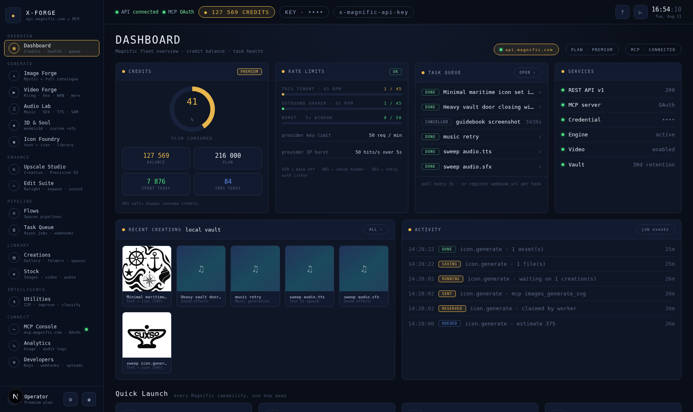

### Topbar

| Element | Meaning |
|---|---|
| `API connected` | The REST key answered an authenticated call in the last minute |
| `MCP OAuth` | The MCP session handshook successfully |
| `◆ N CREDITS` | **Spendable** credits: the account balance minus what open jobs have reserved |
| `KEY · …9f79` | Last four characters of the stored key. Click to open Developers |
| `x-magnific-api-key` | A reminder of the auth header. Click to open Developers |
| `EN ⌄` | Language — English or Ukrainian |
| Clock | Local time, for correlating with job ages |

The credit chip is the number that matters. If the balance says 40 000 and two video jobs
are in flight, the chip shows what is actually left to spend.

### Language

The picker beside the clock switches the console between English and Ukrainian. The choice
is stored in the browser, so it survives a reload and applies to the approval page as well —
that page opens from a link in a chat client, with none of this shell around it.

The translation is by string rather than by identifier: anything not yet translated appears
in English instead of as a placeholder. Model names, endpoint paths and provider states
(`needs_recon`, `widescreen_16_9`) stay as the provider spells them in both languages —
translating them would make them harder to match against the API's own answers. This
guidebook exists in both languages too: [`GUIDEBOOK.uk.md`](GUIDEBOOK.uk.md).

### Sidebar

Sixteen views in six groups. Every view is mounted only while shown, so opening one starts
its own polling and leaving it stops. The dot beside **MCP Console** is green when the
session is live, red when it is not.

### Toasts

Bottom-right. Amber for information, green for success, red for failure. Errors stay for
nine seconds; everything else for four and a half.

---

## 3. How a job works

Every generation in this console — regardless of which screen you started it from — becomes
a *job* and walks the same path. Understanding it takes two minutes and explains every
message you will see.

```
created → validating → budget_check → queued → reserved
       → submitted → running → downloading → succeeded
                            ↘ failed_retryable → queued  (once, at most)
                            ↘ failed
                            ↘ needs_recon
validating → blocked_approval → budget_check
budget_check → rejected_budget
* → cancelled  (only before submitted)
```

**validating** — the price is fetched from Magnific's own cost simulator before anything
runs.

**blocked_approval** — the estimate is over your threshold, or the provider refused to
quote a price. The console gives you a one-time link; nothing runs until a human opens it.
See [§21](#21-the-approval-page).

**budget_check** — seven checks, in this order: the tenant is active; a credential exists;
you are under your concurrent-job limit; the balance minus the estimate stays above your
credit floor; video is enabled if this is video; you are under your own RPM limit; the
global outbound shaper has room.

**reserved** — the estimate is held against your balance so two jobs cannot each spend the
last of it.

**submitted → running → downloading** — the work is with Magnific. Results are downloaded
into the local vault immediately, because provider URLs expire in about a day.

**succeeded** — the ledger is written **once**, in the same transaction that closes the
reservation.

**needs_recon** — the console lost contact after submitting. The work may have happened and
may already have cost money, so it is never re-run automatically. Resolve it in
[Task Queue](#14-task-queue).

Two rules worth internalising:

- **Nothing is ever downgraded to fit your budget.** A job that would breach the floor is
  rejected with the reason. It does not quietly drop from 4k to 2k.
- **An identical request returns the original job.** Same capability, same parameters, same
  prompt → the same job, not a second charge.

---

## 4. Dashboard


**Credits** — the ring is how much of the monthly plan has been consumed. `BALANCE` is what
the account holds, `PLAN` is the monthly allowance, `SPENT TODAY` and `JOBS TODAY` come from
the console's own ledger. The line underneath tells you how much is reserved by jobs that
have not finished.

**Rate Limits** — three live meters, all measured by this console, not guessed:

| Meter | What it counts |
|---|---|
| `THIS TENANT · N RPM` | Your own outbound requests in the last minute |
| `OUTBOUND SHAPER` | All tenants' requests through this process |
| `BURST · 5s WINDOW` | Requests in the last five seconds |

Magnific allows 50 requests per minute per key. When the tenant meter hits its ceiling, new
jobs are **rejected** with `rpm_exceeded` — that is the shaper protecting the key, not a
bug. Wait a minute, or raise the limit in Developers.

**Task Queue** — the six most recent jobs. `OPEN ›` goes to the full queue.

**Services** — six lights: REST, MCP, credential, engine status, whether video is enabled,
and the vault's retention setting.

**Recent Creations** — thumbnails from the local vault. These are files on your disk, not
provider URLs, so they do not expire.

**Activity** — the job event log, which is every state transition with its reason.

**Quick Launch** — four shortcuts to the screens people use most.

---

## 5. Chat

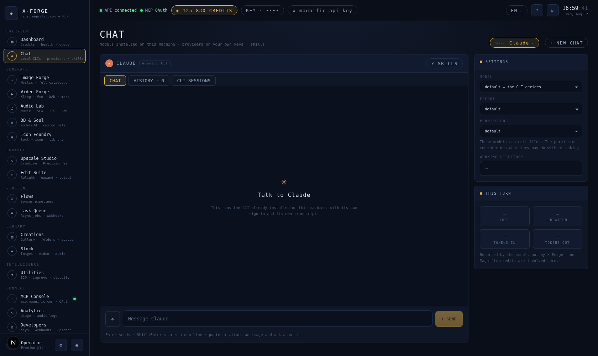

The one screen here that does not talk to Magnific. It talks to the coding CLIs already
installed on this machine — Claude Code, Grok, Kimi, Qwen Code, Codex, Antigravity — and to
any HTTP provider you have given a key. No Magnific credits are spent in this view, no job
is created, and nothing appears in the Task Queue: the console is not paying for these
turns, the CLI's own account is.

### Choosing a model

One conversation, one selector. The chip at the top of the screen lists every model X-Forge
knows how to drive, with a light: green when the command is on this machine's PATH, red when
it is not. Nothing is hidden — "Grok is not installed" is
more useful than a list that quietly omits it. Hovering a model shows where its binary was
found, which is the fastest way to notice that the console found a different Claude than
your shell does.

The choice is kept on the server rather than in the browser, because it is a fact about
this installation rather than about a tab: pick Grok here and the console is talking to Grok
when you open it again tomorrow.

Switching model does not start a new conversation. Each CLI keeps its own transcript, so
returning to one resumes where it was; a model being asked its first question in a
conversation that started elsewhere is handed a short recap of what was said, which is what
makes one chat behave like one chat.

The detection is a lookup, not a setting. Install a CLI in another terminal and the list
notices within half a minute. Note that Antigravity is reached through its `agy` command
rather than the `antigravity` on your PATH — that one is the Electron editor, and running it
opens the whole IDE.

Each CLI speaks its own dialect: Claude and Qwen Code share an envelope, Kimi emits bare
messages, Grok calls its deltas `data`, Codex emits completed items, agy nests everything
under a step update. X-Forge reads each one separately and drops anything it does not
recognise, because a console that guesses at an unfamiliar line prints something the model
never said.

### A turn

One message spawns the CLI once, in its own non-interactive mode, and streams what it
prints. The process is not kept alive between turns — continuity comes from the CLI's own
transcript, resumed by the session id shown beside the model's name. That means the
conversation survives a restart of this console, and that the CLI owns the history rather
than X-Forge keeping a worse copy of it.

Leaving the view stops the turn. A model that keeps running after nobody is reading spends
its own account's money on output that goes nowhere.

| Control | What it does |
|---|---|
| Model | Passed straight through as the CLI's `--model`. Empty means the CLI's own default |

| Effort | Reasoning budget, where the CLI has the flag |
| Permissions | What the model may do to files without asking. These are agentic CLIs — they can edit |
| Working directory | Where the CLI runs. Defaults to your home directory |

### History, and the model's own transcripts

Three tabs sit under the model's name.

**CHAT** is the conversation you are in. **HISTORY** lists the conversations this browser
has kept — click one to reopen it, including the CLI session ids that belong to it, so it
continues rather than merely being readable. **CLI SESSIONS** lists what the model itself
wrote on this machine: `~/.claude/projects`, `~/.grok/sessions`, `~/.codex/sessions` and so
on, transcripts that predate this console and outlive it. Opening one continues it — the
model keeps the context, this panel starts empty, and it says so.

Deleting in HISTORY forgets a conversation in this browser. Deleting under CLI SESSIONS
removes the transcript from disk, which is the CLI's own record.

### Files

Attach with the `⊕` button, or paste an image straight into the composer — a screenshot in
the clipboard is the commonest attachment there is.

A file is written to disk and its path is put in the prompt, because these CLIs are agents
with filesystem access: given a path, the model opens the file itself, at full resolution,
with whatever tool suits it. That also survives the resume of a later turn, which an inlined
copy would not. A provider has no filesystem, so an image travels to it as data instead and
anything else is named rather than sent.

Ask for a prompt from a picture and you get one; the next section is what to do with it.

### Sending an answer to a generator

Under every finished answer are two buttons. `⧉ COPY` does the obvious thing.
`→ USE AS PROMPT` opens the five generators that take one — Image Forge, Video Forge, Audio
Lab, Icon Foundry, Upscale Studio — and sends the text there, switching to that screen with
the field already filled.

When the answer contains a fenced block, the block is what travels rather than the prose
around it: asked for a prompt, a model puts the prompt in a fence and its explanation
outside, and the explanation is not what should be generated.

### Providers

Below the CLIs are the HTTP providers: OpenRouter, TokenRouter, FreeInference, and any
endpoint you add yourself in **Developers → Model & Provider Keys**. Anything that answers
the OpenAI chat shape at `/chat/completions` works. A provider turn is billed by that
provider on your key, and — unlike a CLI — it has no filesystem, no tools and no session of
its own, so the last twenty messages are replayed with each turn.

### Skills

A skill is a folder of instructions a model can be told to follow, discovered by the CLI
from its own skills directory. The picker beside the model's name lists what is installed,
and searches [skills.sh](https://skills.sh) for what is not.

Three ways in, all through the same gate: install from the registry, upload your own as a
zip or a folder, or paste a `SKILL.md` straight in. `🔍 PREVIEW` downloads a registry skill
into quarantine and shows you its text and its verdict without installing anything — which
is the honest order to do this in, since the whole question is whether you want that text on
your machine.

Selected skills are named in the prompt, which is what makes the model reach for one rather
than merely have it available. For a provider, which discovers nothing, the skill's text is
read from disk and sent as a system message instead.

**Everything installed here is scanned first.** A download lands in a quarantine directory,
the scanner reads it there, and only then is it promoted — or deleted. There are three
verdicts:

| Verdict | Meaning |
|---|---|
| `INSTALL` | Nothing suspicious was found. It is written to the skills directory |
| `REVIEW` | Something needs a person: a shell script the scanner cannot inspect, or a pattern that is explainable but worth reading. Installable only by overriding, with a reason |
| `REJECT` | Hard evidence: a download piped into a shell, an instruction to send credentials somewhere, an instruction to hide what it is doing from you. Not installable at all |

The scan is static — it reads files and matches patterns, it never executes anything. That
catches the obvious attacks and does not catch a clever one, which is why the findings are
shown to you rather than summarised into a tick. Every decision, including an override and
its reason, is appended to `~/.x-forge/skill-audit.jsonl`.

A skill is somebody else's text about to be handed to a model that can run commands on your
machine. Read the verdict.

---

## 6. Image Forge

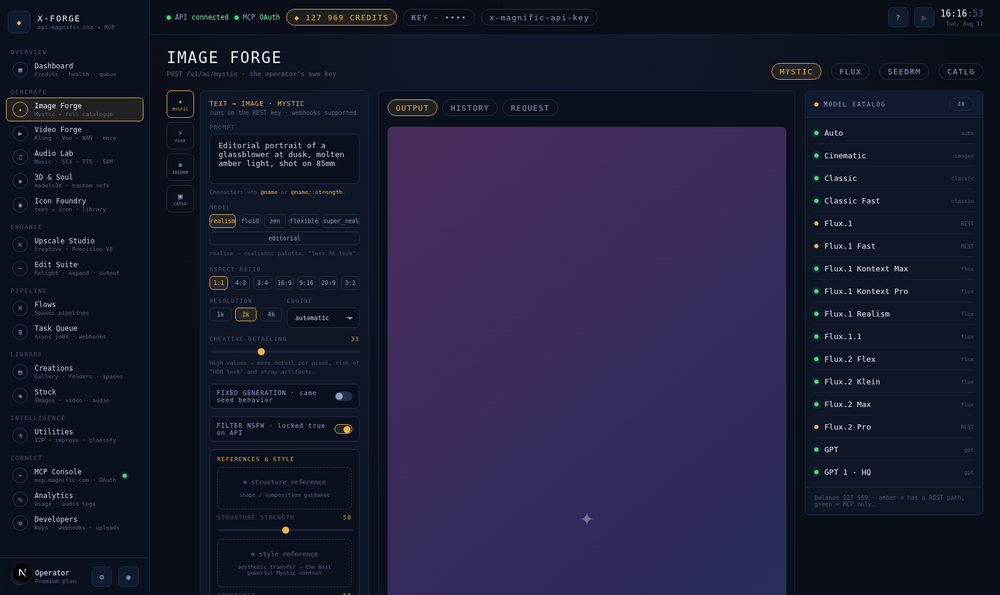

The main generator. Four tools along the top pick which path you run on.

| Tool | Runs on | Reaches |
|---|---|---|
| `MYSTIC` | REST | Mystic, with its full parameter set — references, LoRAs, engines |
| `FLUX` | REST | FLUX.1 dev |
| `SEEDRM` | REST | Seedream 4.5 |
| `CATLG` | MCP | The **whole** catalogue — 48 models, chosen from a dropdown |

The REST tools give you every Magnific-specific control. The catalogue gives you every
model Magnific offers, with a simpler parameter set. Neither is better; they are different
surfaces, and the panel header always says which one you are on.

### Using it

1. **PROMPT** — plain language. If you have trained a character in [3D & Soul](#9-3d-soul),
   reference it as `@name`, or `@name::200` to push its strength.
2. **MODEL** — for Mystic, six looks (`realism` is the least "AI-looking"). For the
   catalogue tool, a dropdown of all 48 models with their typical generation time.
3. **ASPECT RATIO** and **RESOLUTION** — `2k` is the sensible default; `4k` costs more.
4. **CREATIVE DETAILING** — how much detail Mystic invents per pixel. High values look
   striking and produce stray artifacts. 30–40 is a good working range.
5. **REFERENCES & STYLE** — drop an image into `structure_reference` to control composition,
   or `style_reference` to transfer a look. The sliders under each control how strongly.
   **References silently disable LoRAs** — that is Magnific's behaviour, and no error is
   returned, so pick one approach or the other.
6. **STYLING · LORA** — the characters and styles trained on this account. Click to include.
7. **WEBHOOK_URL** — optional; the console polls anyway.
8. Press **GENERATE**. The button always shows the current estimate.

### The workspace

`OUTPUT` shows the result and its badges: status, path used, credits, file count.
`HISTORY` is your previous successful jobs — click one to bring it back.
`REQUEST` shows exactly what the console will send, with base64 payloads collapsed to their
size. Use it when something is rejected and you want to see the actual body.

### The catalogue panel

All 48 models, live from the server. **Amber dot** = also reachable on REST (more controls);
**green dot** = MCP only. Clicking a model switches to the catalogue tool with it selected.

---

## 7. Video Forge

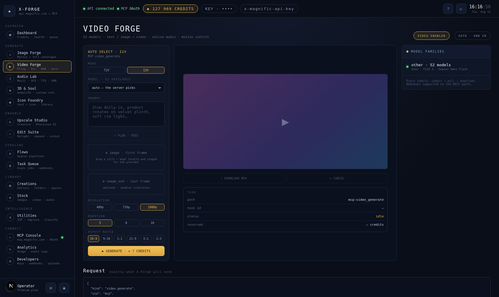

Video is the expensive family — a five-second clip is typically 225–1 500 credits — so this
screen is built around knowing the price first.

### Using it

1. **MODE** — `T2V` (text only) or `I2V` (from a still).
2. **MODEL** — 52 models, or `auto`. When you pick one, the panel shows the durations it
   accepts. Models with a REST path run on your key; the rest run over MCP.
3. **PROMPT** — describe the motion, not just the scene. "Slow dolly-in, product rotates on
   velvet plinth" beats "a product".
4. **PLAN · FREE** — runs Magnific's own planner. It costs nothing and returns a brief, a
   recommended model and a prompt draft. Worth doing before spending 300 credits.
5. For `I2V`, drop a **first frame**. The console stages it to a hosted URL automatically —
   the video models refuse inline images. Optionally add a **last frame** for a transition.
6. **RESOLUTION / DURATION / ASPECT RATIO** — the console translates these into whatever
   wire format the endpoint wants.
7. Toggles: native audio, locked framing, a seed for repeatability.
8. **GENERATE**. Anything over your threshold produces an approval link instead of running.

Models are chosen from a **Model Catalog** list on the right, exactly like Image Forge's.
**Let the server pick** sits at the top and leaves the choice to `auto`; clicking any other
row selects that model.

The **TASK** panel underneath shows the endpoint, the provider task id, the live status and
what was reserved. The **Request** block at the bottom of the page is the exact payload.

> **If video is disabled** the button refuses and tells you. Enable it in
> **Developers → Engine Limits → VIDEO GENERATION**. It is off by default deliberately: it
> is the fastest way to spend a lot of credits by accident.

---

## 8. Audio Lab

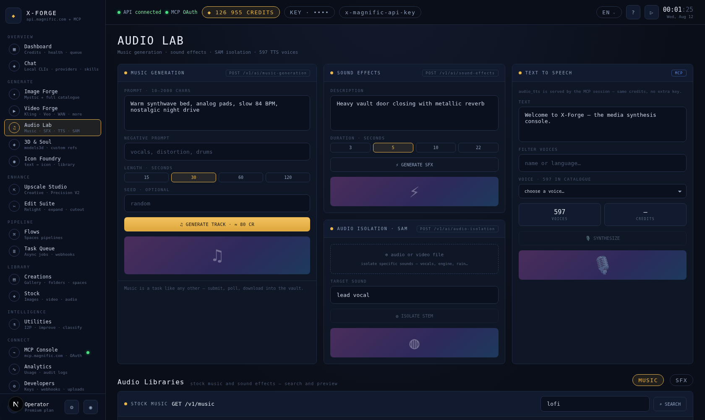

Four independent tools. Each has its own runner, so you can have a music render and a sound
effect in flight simultaneously without them overwriting each other's results.

**Music Generation** (REST, ~80 credits for 15 s) — prompt, optional negative prompt,
length, optional seed. Describe instrumentation and tempo; "warm synthwave bed, analog pads,
84 BPM" works better than "nice music".

**Sound Effects** (REST, ~20 credits) — one short description, one duration. Good for
foley and interface sounds.

**Audio Isolation · SAM** (REST) — drop an audio or video file, name the sound you want
pulled out ("lead vocal", "engine", "rain"). The description is what steers it, not the
file.

**Text to Speech** (MCP) — needs the MCP session. The voice dropdown carries the account's
full catalogue (about 600 voices); the filter box searches by name and language. Cost scales
with text length and is shown before you press the button.

**Audio Libraries** at the bottom search Magnific's stock music and sound-effect catalogues.
These are downloads against your plan's daily allowance, not credit purchases.

---

## 9. 3D & Soul

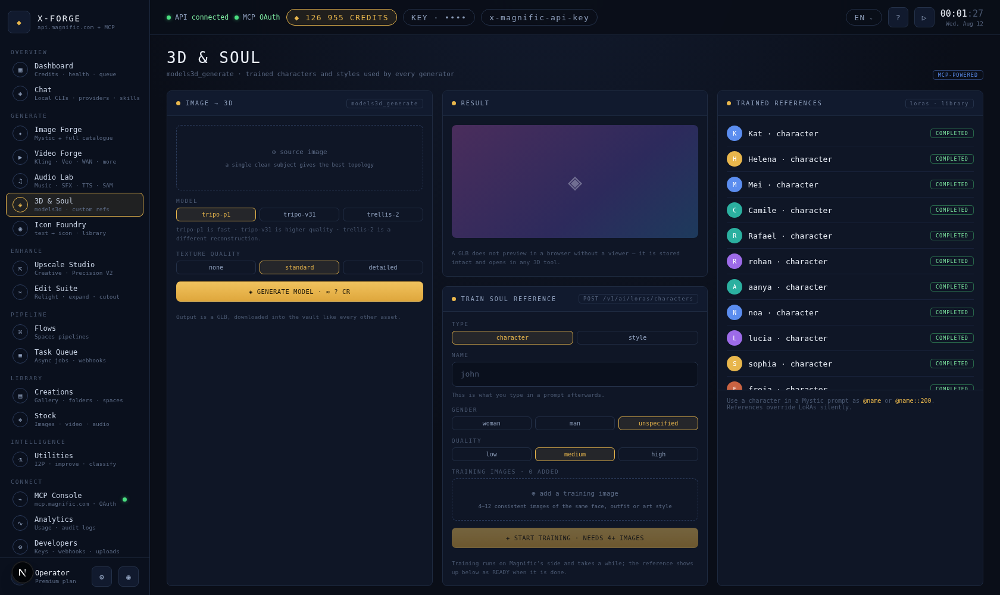

### Image → 3D

`models3d_generate` is **image**-to-3D, not text-to-3D. Drop a picture of a single clean
subject; the console imports it as a creation for you.

- `tripo-p1` — fast, the default
- `tripo-v31` — higher quality
- `trellis-2` — a different reconstruction approach

Output is a GLB (~580 credits), downloaded to the vault. A browser cannot preview a GLB
without a viewer, so it is stored intact for you to open in a 3D tool.

### Train Soul Reference

Teaches Magnific a character or a style you can then use by name in any prompt.

1. **TYPE** — `character` (a person) or `style` (an aesthetic).
2. **NAME** — this is literally what you will type in prompts afterwards, as `@name`.
3. **GENDER** (characters only) and **QUALITY**.
4. **TRAINING IMAGES** — drop **at least four**, ideally 4–12, all consistent: the same face,
   the same outfit, or the same art style. Each drop is staged and added to the list; click a
   chip to remove it.
5. **START TRAINING**. Training runs on Magnific's side and takes a while — the reference
   appears in the list on the right marked `READY` when it finishes.

### Trained References

Everything this account can already use, from both places references live: LoRAs on the REST
key and the Library on the MCP session. The list is cached for five minutes because the
provider's endpoint takes about twelve seconds to answer.

---

## 10. Icon Foundry

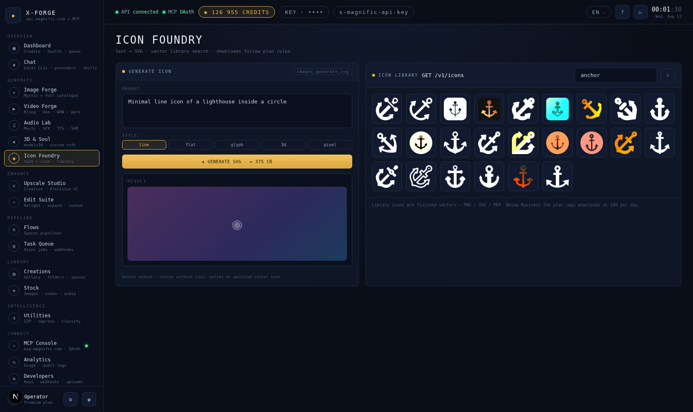

Two halves that answer the same question — "I need an icon" — in opposite ways.

**Generate Icon** (~375 credits) makes an icon that does not exist yet, as a real SVG.
Describe it, pick a style (`line`, `flat`, `glyph`, `3d`, `pixel`), generate. Vector output
scales without loss, unlike an upscaled raster icon.

**Icon Library** searches Magnific's catalogue of finished vectors. Free against your plan's
download allowance.

**Search the library before generating.** If the icon already exists, generating it again
costs 375 credits for no benefit.

---

## 11. Upscale Studio

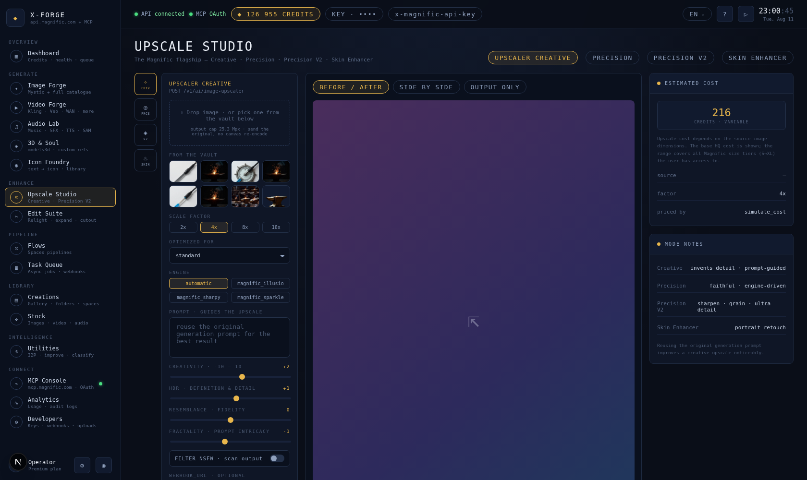

The Magnific flagship, in four modes.

| Mode | What it does | Use when |
|---|---|---|
| **Creative** | Invents plausible detail, guided by a prompt | The source is small or soft and you want it to look striking |
| **Precision** | Faithful enlargement, engine-driven | The content must not change |
| **Precision V2** | Faithful, with sharpen / grain / ultra-detail controls | Photographic work needing fine control |
| **Skin Enhancer** | Portrait retouch | Faces |

### Using it

1. Drop an image, **or** click one from **FROM THE VAULT** — anything you have generated is
   one click away.
2. **SCALE FACTOR** — 2× to 16×. This is the single biggest cost driver: cost scales with
   *output* area, so 16× on a large source is an order of magnitude more than 2× on a small
   one. The **Estimated Cost** panel on the right shows the provider's own number and its
   range across size tiers.
3. **OPTIMIZED FOR** — tell it what the picture is (portraits, landscapes, game assets, 3D
   renders…). This matters more than people expect.
4. **ENGINE** — `automatic` unless you know you want `illusio`, `sharpy` or `sparkle`.
5. **PROMPT** — for Creative mode. *Reuse the original generation prompt* if you have it;
   it noticeably improves the result.
6. **CREATIVITY / HDR / RESEMBLANCE / FRACTALITY** — all −10…+10. Start at 0 and move one at
   a time. High creativity plus high HDR is where the "over-processed" look comes from.

The workspace has three views: `BEFORE / AFTER` (side-by-side), `SIDE BY SIDE`, and
`OUTPUT ONLY`.

---

## 12. Edit Suite

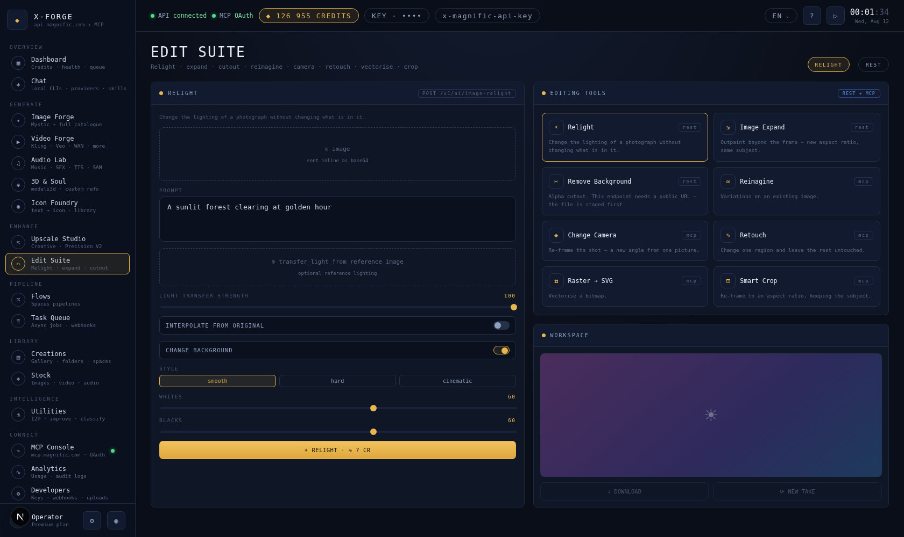

Eight tools that take one image and return one image. Pick a tool from the grid, drop a
picture, fill in what that tool needs. The form changes with the tool.

| Tool | Path | Needs | Notes |
|---|---|---|---|
| **Relight** | REST | inline image | Changes lighting without changing content. Optional reference image to copy lighting from |
| **Image Expand** | REST | inline image | Outpaints beyond the frame into a new aspect ratio |
| **Remove Background** | REST | **hosted URL** | Refuses inline images — the console stages the file for you |
| **Reimagine** | MCP | creation | Variations on an existing image |
| **Change Camera** | MCP | creation | A new angle on the same scene |
| **Retouch** | MCP | creation | Change one region, leave the rest |
| **Raster → SVG** | MCP | creation | Vectorise a bitmap |
| **Smart Crop** | MCP | creation | Re-frame to a ratio, keeping the subject |

You do not have to care which form the input needs: one drop produces all three (a local
copy, a hosted URL, and an MCP creation) and each tool takes what it wants. If the MCP
session is down, the MCP tools will say so rather than failing obscurely.

**Relight** has the deepest controls: light transfer strength, whether to interpolate from
the original, whether the background may change, and separate whites/blacks levels.

---

## 13. Flows

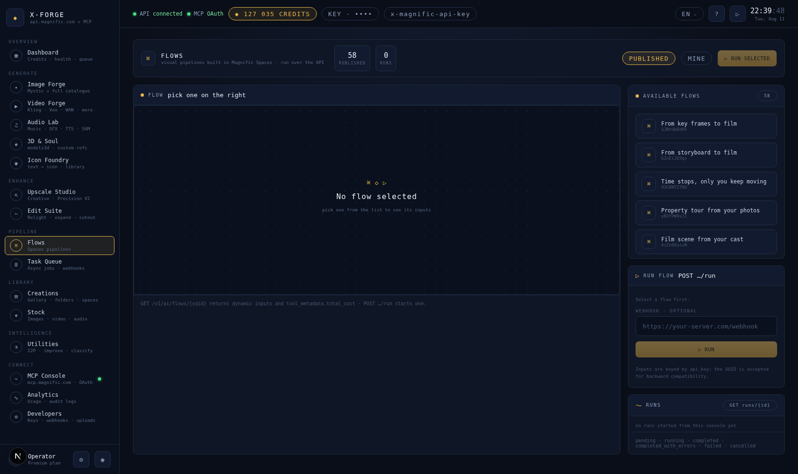

A flow is a pipeline someone built on Magnific's Spaces canvas and published. This screen
runs them.

1. Pick `PUBLISHED` (the whole catalogue — 57 at the time of writing) or `MINE`.
2. Select one. The canvas draws its shape and the header shows its cost per run.
3. The **Run Flow** panel builds itself from that flow's declared inputs — every flow has a
   different set, so nothing here is hardcoded. Fill them in.
4. Optionally add a webhook.
5. **RUN**.

Runs appear in the **Runs** panel with a `POLL` button. Statuses are the provider's:
`pending`, `running`, `completed`, `completed_with_errors`, `failed`, `cancelled`.

Flow results are valid for about twelve hours, shorter than everything else.

---

## 14. Task Queue

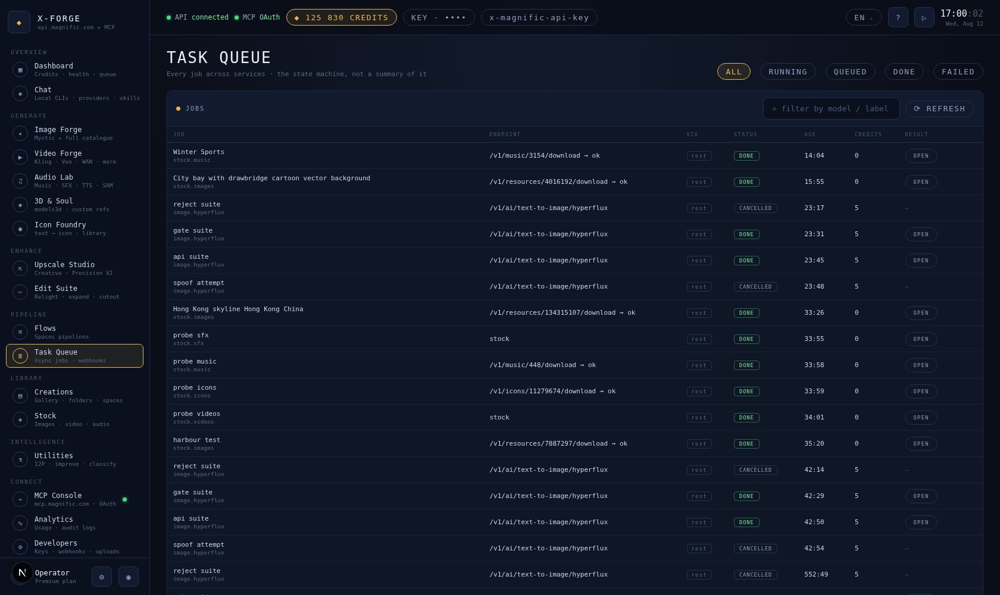

Every job the engine has, filterable by state. The columns tell you the job, the exact
endpoint it used, whether it went over `rest` or `mcp`, its state, its age, its credits, and
what you can do about it.

**Click any row** to open its detail: the parameters, the provider task id, estimate versus
actual, and the complete transition history with timestamps and reasons. This is the fastest
way to understand what a job actually did.

### What the actions mean

| Button | When it appears | What it does |
|---|---|---|
| `OPEN` | The job produced files | Opens the asset |
| `CANCEL` | Before submission | Cancels the job. Nothing was spent |
| `RECONCILE` | `needs_recon` only | Asks Magnific what happened to the task |

**`RECONCILE` is the important one.** A job in `needs_recon` means the console lost contact
after submitting — the generation may have completed and charged you. Reconciling asks the
provider directly: if the work exists it is downloaded and the ledger is written once; if it
failed, the job is marked failed. The console will never silently re-run it, because that
would be paying twice for the same picture.

The three panels underneath document the polling strategy, the webhook signature scheme, and
what the console does with each provider error code.

---

## 15. Creations

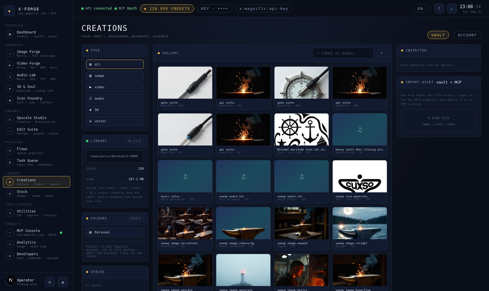

Two libraries, deliberately not merged.

**VAULT** — everything this console has generated, downloaded to your disk. Permanent,
playable, searchable by label or model.

**ACCOUNT** — the Magnific account's own recent creations, made anywhere. URLs here expire.

### Where the files actually are

The **LIBRARY** panel on the left shows the path, the file count and the size on disk. By
default that is `~/.x-forge/vault`; set `FORGE_VAULT_DIR` to put it somewhere you browse —
an Obsidian vault, a project folder — and X-Forge keeps it tidy for you:

```
X-FORGE/
  image/   2026-08-11_editorial-portrait_A1B2C3.jpg
           2026-08-11_editorial-portrait_A1B2C3.md
  video/   audio/   3D/   vector/
```

Each asset gets a markdown note beside it carrying the prompt, the model, the cost, the
endpoint and the job id in frontmatter, and embedding the file itself — so in Obsidian the
library is browsable, searchable and linkable rather than a folder of binaries.

**FOLDERS** and **SPACES** below it are marked `REMOTE` because they are: those live in your
Magnific account, not on this machine.

### Opening things

Click any tile to load the **Inspector** and open the full-size viewer.

| | |
|---|---|
| scroll | zoom towards the pointer |
| drag | pan, once zoomed in |
| double-click | toggle between fit and 2× |
| `+` `−` `0` | zoom in, out, fit |
| `1:1` | actual pixels — the header shows the real dimensions |
| `←` `→` | previous and next asset without leaving the viewer |
| `Esc` | close |

**3D models open in a real viewer** — drag to orbit, scroll to dolly. The engine loads only
when you first select a model, so a gallery of stills never pays for it. GLB files also
render inline in the Inspector.

Video and audio open with full-size players. The same viewer is behind every result panel in
the forges, so you can check an upscale at actual pixels the moment it lands.

**Import Asset** is the three-way importer: one drop stores the file locally, stages it for
the REST endpoints, and imports it as an MCP creation — the same thing every dropzone in the
console does.

---

## 16. Stock

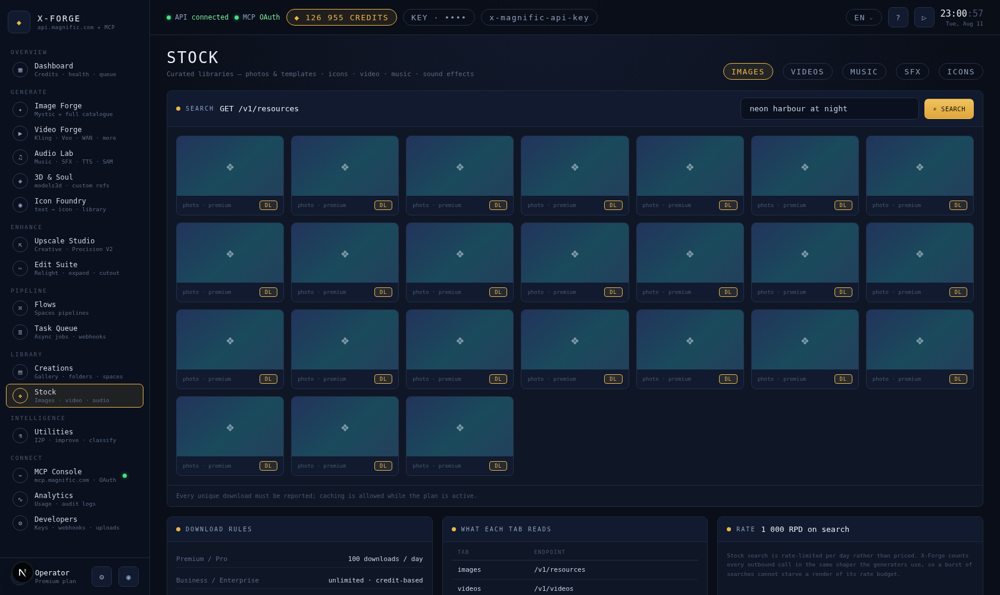

Ten libraries behind one search box. Six of them are the one resources endpoint with a
content-type filter — photos, vectors, illustrations, templates, PSDs, mockups — and the
other four are their own endpoints: videos, icons, music, sound effects. Type, press Enter
or `SEARCH`.

The provider's own site also lists 3D models and fonts. Neither is here, because no filter
this API honours selects them: the answer comes back unfiltered, and a tab that quietly
shows you photos labelled "fonts" is worse than a tab that is missing.

### Getting the file

`DL` downloads. The file arrives **here** — fetched through the provider's signed URL and
filed in the vault beside everything X-Forge has made, with the same naming and the same
markdown note. The caption beside it still links to the item's page at the provider, for
when you want the licence or the author rather than the file.

Clicking a tile opens it full size; a video plays there. Sound effects play from the list.
Music plays too, but the first press has to fetch the track — the library returns no preview
URL, only a download one, so playing a track costs the same call downloading it does. On a
plan with a hundred a day, that is worth knowing before you audition twenty.

### What it costs

Stock is **not** priced in credits. Below a Business plan you get 100 downloads a day; on
Business and above it is unlimited. The panels at the bottom document the rules, which
endpoint each tab reads, and the fact that stock searches share the same outbound rate
budget as your renders.

Usage terms worth remembering: no data mining, no scraping, no resale without modification.

---

## 17. Utilities

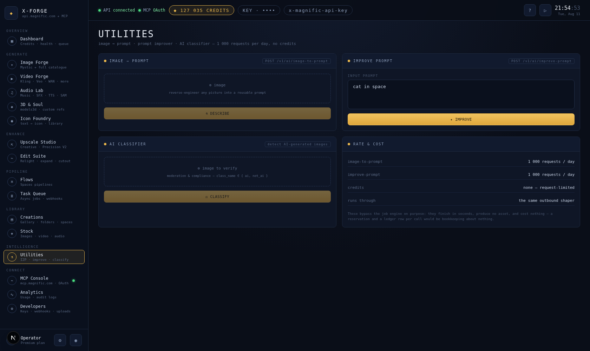

Four small tools that answer in words instead of files. They cost no credits — they are
limited to 1 000 requests a day instead — and they run immediately rather than going through
the job engine.

**Image → Prompt** — drop a picture, get a reusable prompt describing it. `SEND TO IMPROVER`
chains it into the next tool.

**Improve Prompt** — turns a thin prompt into a detailed one. `IMPROVE AGAIN` iterates.

**AI Classifier** — checks whether an image was AI-generated. This capability is plan-gated;
if your plan does not include it the panel reports the provider's own answer rather than
showing an empty result.

**Video Plan** lives in [Video Forge](#7-video-forge) rather than here, because that is where
you need it.

---

## 18. MCP Console

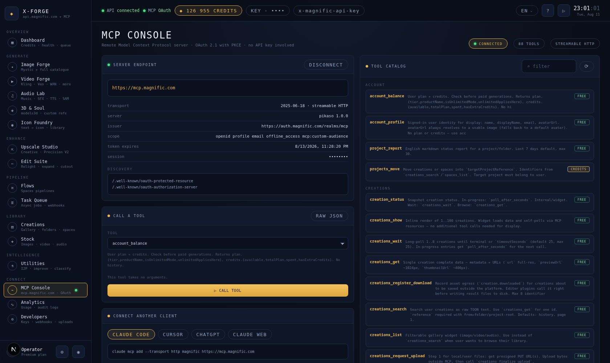

The Model Context Protocol side of Magnific: 88 tools reached over an OAuth session, no API
key involved.

### Connecting

Press **CONNECT**. A popup opens Magnific's sign-in; approve once. The console registers
itself dynamically, uses PKCE, and asks for `offline_access` so the session survives longer
than an hour. Everything on the page refreshes when you come back.

**DISCONNECT** forgets the tokens. The REST paths keep working.

### The server panel

Transport, server identity, issuer, scopes, token expiry and session id. If the session is
broken this panel says why in plain terms.

### Call a tool

This is a real console, not a demo.

1. Pick a tool from the dropdown — all 88, with their descriptions.
2. The argument form **builds itself from that tool's JSON schema**: enums become dropdowns,
   numbers are sent as numbers, required fields are marked. Switch to `RAW JSON` if you would
   rather type the object yourself.
3. **CALL TOOL**.

Tools that spend credits are priced first: the console runs the cost simulator, shows you the
number, and waits for **CONFIRM AND SPEND**. Free tools run immediately. Results are shown as
data, with any returned images rendered inline.

### Tool Catalog

All 88 tools, grouped, each labelled `FREE` or `CREDITS`. Filter by name; click any tool to
load it into the caller. This list is `tools/list` read live from the server, so a tool
Magnific ships next week appears here without a code change.

### Connect another client

Copy-paste setup for Claude Code, Cursor, ChatGPT and Claude web. Any streamable-HTTP MCP
client works.

---

## 19. Analytics

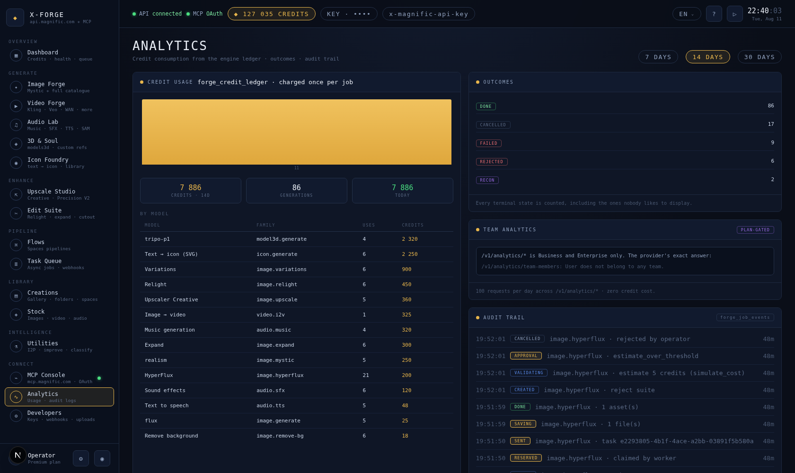

**Credit Usage** is the console's own ledger — one row per job, written once, in the same
transaction that closed its reservation. Pick 7, 14 or 30 days. The bars are daily spend;
hover for exact figures.

**By Model** breaks the same spend down by model and capability, which is how you find out
that upscales are quietly your biggest line item.

**Outcomes** counts every terminal state, including the unflattering ones — failures,
budget rejections and cancellations are all shown.

**Team analytics** is Magnific's own `/v1/analytics/*`, available on Business and Enterprise
plans. On other plans the panel says exactly that, with the provider's own message, rather
than rendering an empty chart.

**Audit trail** is the job event log: every state transition with its reason.

---

## 20. Developers

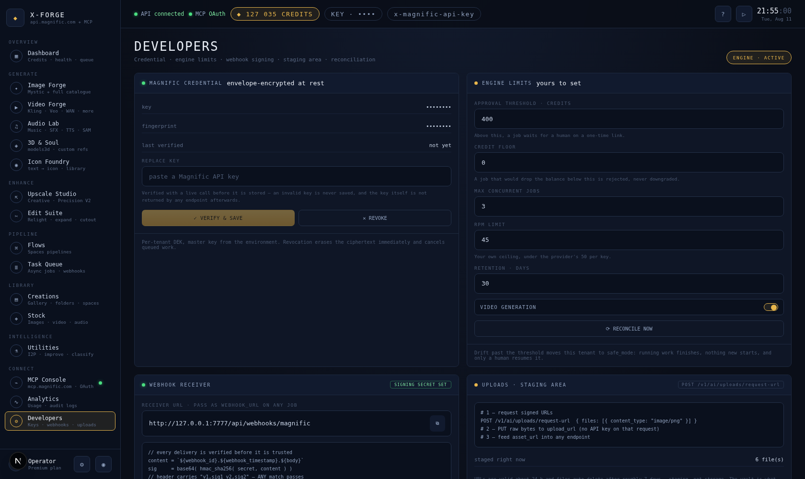

The control panel for the engine itself.

### Magnific Credential

Shows the last four characters, a truncated fingerprint and when the key was last verified.
The key itself is never displayed, returned or logged.

- **VERIFY & SAVE** — paste a new key. It is checked with a live call *before* being stored;
  an invalid key is never saved and the previous one is restored.
- **REVOKE** — erases the stored key immediately and cancels everything queued.

### Engine Limits

These are yours to set. Change a value and press `SAVE`.

| Limit | What it does | Sensible default |
|---|---|---|
| **APPROVAL THRESHOLD** | Any job estimated above this waits for a human | 400 credits |
| **CREDIT FLOOR** | Jobs that would drop the balance below this are rejected | 0, or a reserve you never want touched |
| **MAX CONCURRENT JOBS** | How many jobs may be in flight | 3 |
| **RPM LIMIT** | Your own ceiling, under Magnific's 50/min per key | 45 |
| **RETENTION · DAYS** | How long vault files are kept | 30 |
| **VIDEO GENERATION** | Master switch for the whole video family | Off until you need it |

If the reconciler ever parks the engine in `safe_mode` — it does that when the balance drifts
from what the ledger expects — this panel is where you read why and press `RESUME`.
**RECONCILE NOW** runs that check on demand.

### Webhook Receiver

The URL to pass as `webhook_url` on any job, the verification scheme, and a live record of
recent deliveries marked `VERIFIED` or `REJECTED`. An unverified delivery is answered `401`
and never acted on; a replayed one outside the freshness window is refused even with a valid
signature.

### Uploads · Staging Area

How many files are currently staged provider-side, and the three-step protocol behind every
dropzone in the console. Staged files expire in about a week — the vault is what keeps
things.

---

## 21. The approval page

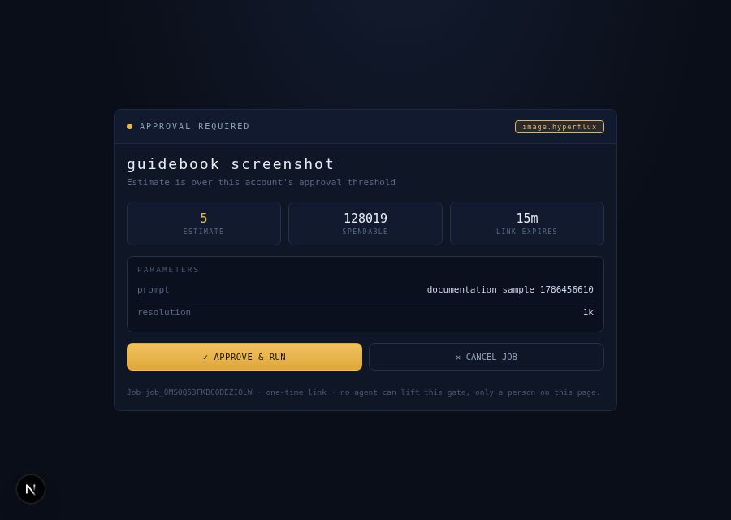

When a job's estimate is over your threshold — or the provider will not quote a price at all
— the console does not run it. It gives you a link like:

```
http://127.0.0.1:7777/a/job_0MSOQ53FKBC0DEZI0LW/6fa58580e9476168d43a9458a315c43e
```

The page opens with no session, so you can send it to whoever holds the budget. It shows the
model, the parameters, the estimate, your spendable balance and the time remaining.

- **APPROVE & RUN** queues the job.
- **CANCEL JOB** ends it, having spent nothing.

The link is **single-use** and expires after fifteen minutes. There is deliberately no API
endpoint and no MCP tool that approves a job — an agent must not be able to imitate a human
saying yes.

---

## 22. Costs at a glance

Measured on a Premium account. Treat as orders of magnitude, not a price list — the console
always shows the provider's own estimate before you commit.

| Operation | Typical | Notes |
|---|---|---|
| Remove background | 3 | Cheapest thing here |
| Image · HyperFlux | 5 | Cheapest generator; ideal for tests |
| Text to speech | 2–10 | Scales with text length |
| Sound effect | 20 | |
| Image · Mystic / FLUX.2 / Seedream | 50 | |
| Image expand | 50 | |
| Upscale 2× | 72 | Scales with **output** area |
| Relight | 75 | |
| Music, 15 s | 80 | |
| Variations | 150 | |
| Upscale 4× on a 1k source | ~216 | |
| Video, 5 s | 225–1 500 | Varies enormously by model |
| Icon → SVG | 375 | Search the library first |
| Image → 3D GLB | 580 | |
| Stock downloads | 0 | Daily allowance, not credits |
| Utilities | 0 | 1 000 requests/day |

A full sweep of every capability in the console, once each, on the cheapest settings, is
about 2 300 credits.

---

## 23. When something goes wrong

### "rejected_budget · rpm_exceeded"

You are at your requests-per-minute ceiling. The shaper is protecting the key. Wait a minute
or raise **RPM LIMIT** in Developers — but not above 50, which is Magnific's own limit.

### "rejected_budget · insufficient_credits"

The estimate would push the balance below your credit floor. Lower the floor, top up the
account, or choose a cheaper model. The console will not silently reduce quality to fit.

### "rejected_budget · video_disabled"

Enable video in **Developers → Engine Limits**.

### "rejected_budget · max_concurrent"

Too many jobs in flight. Wait, or raise the limit.

### A job sits in `needs_recon`

The console lost contact after submitting. Open **Task Queue**, click `RECONCILE`. If the
work completed, it is downloaded and charged once; if it failed, the job is closed. Never
just re-submit — that pays twice.

### "Validation error" with a field name

The provider rejected a specific parameter, and the console passes its exact complaint
through — `duration: Input should be '5' or '10'` means precisely that. The `REQUEST` tab in
Image Forge and the request block in Video Forge show what was sent.

### An MCP tool says "not connected"

The OAuth session expired or was disconnected. **MCP Console → CONNECT**. The REST paths keep
working meanwhile; the affected features are TTS, 3D, cost estimates, the full catalogue and
most of Edit Suite.

### "image → video needs a hosted image"

The still was not staged. Re-drop it and submit again — the console stages uploads
automatically, but a file added before the MCP session came up may lack the hosted copy.

### A generation just fails once

Providers have bad minutes. The console retries a retryable failure once, then stops and
tells you. Submitting again with a slightly different prompt is the fastest test — an
identical prompt returns the original failed job by design.

### The balance looks wrong

Press **RECONCILE NOW** in Developers. It compares the account against the ledger; drift past
the threshold parks the engine in `safe_mode` so nothing new spends until you have looked.
