# X-FORGE · Керівництво оператора

<sub>X-Forge v0.0.2 · автор Yurii S. ([@yuriiss](https://github.com/yuriiss)) · AGPL-3.0-or-later</sub>

Усе в цій консолі витрачає реальні кредити з реального облікового запису Magnific. Цей
посібник описує кожен екран і кожен елемент керування: що він робить, скільки коштує, що
йому потрібно від вас спочатку і що робити, коли він відмовляється працювати.

**Зміст**

1. [Перш ніж почати](#1-перш-ніж-почати)
2. [Оболонка](#2-оболонка)
3. [Як працює завдання](#3-як-працює-завдання)
4. [Панель](#4-панель)
5. [Чат](#5-чат)
6. [Кузня зображень](#6-кузня-зображень)
7. [Кузня відео](#7-кузня-відео)
8. [Аудіолабораторія](#8-аудіолабораторія)
9. [3D і Soul](#9-3d-і-soul)
10. [Ливарня іконок](#10-ливарня-іконок)
11. [Студія апскейлу](#11-студія-апскейлу)
12. [Редактор](#12-редактор)
13. [Потоки](#13-потоки)
14. [Черга завдань](#14-черга-завдань)
15. [Створене](#15-створене)
16. [Сток](#16-сток)
17. [Утиліти](#17-утиліти)
18. [Консоль MCP](#18-консоль-mcp)
19. [Аналітика](#19-аналітика)
20. [Розробникам](#20-розробникам)
21. [Сторінка підтвердження](#21-сторінка-підтвердження)
22. [Вартість коротко](#22-вартість-коротко)
23. [Коли щось іде не так](#23-коли-щось-іде-не-так)

---

## 1. Перш ніж почати

```
npm install
npm run dev          # http://127.0.0.1:7777
```

Консолі потрібні дві речі, і верхня панель показує, чи є вони.

**Ключ API Magnific**, у `.env.local` як `MAGNIFIC_API_KEY`. Він запечатується в базі даних
під час першого запуску і ніколи не залишає сервер — жоден ендпоінт його не повертає, і
браузер його ніколи не бачить. Замінити або відкликати його можна в розділі **Розробникам**.

**Сесія MCP** — це вхід через браузер, а не ключ. Без неї консоль усе ще генерує зображення
та відео через REST-шляхи, але ви втрачаєте: баланс кредитів, оцінки вартості, повний каталог
моделей, синтез мовлення, 3D і більшу частину Редактора. Підключіть її в
**Консоль MCP → CONNECT**.

Дві панелі показують, у якому ви стані в будь-який момент: індикатори `API` / `MCP` на
верхній панелі та **Панель → Сервіси**.

---

## 2. Оболонка

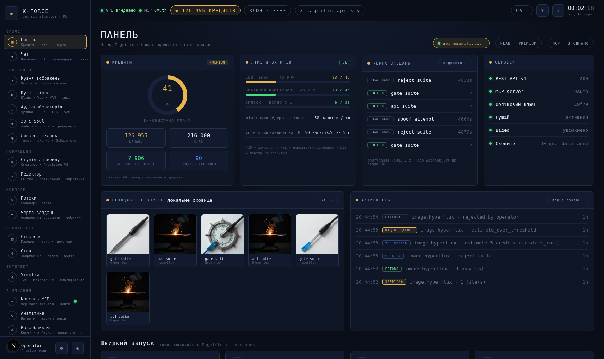

### Верхня панель

| Елемент | Значення |
|---|---|
| `API connected` | REST-ключ відповів на автентифікований запит за останню хвилину |
| `MCP OAuth` | Сесія MCP успішно виконала рукостискання |
| `◆ N CREDITS` | **Доступні для витрати** кредити: баланс облікового запису мінус те, що зарезервовано відкритими завданнями |
| `KEY · …9f79` | Останні чотири символи збереженого ключа. Клацніть, щоб відкрити розділ Розробникам |
| `x-magnific-api-key` | Нагадування про заголовок автентифікації. Клацніть, щоб відкрити розділ Розробникам |
| `UA ⌄` | Мова — англійська або українська |
| Годинник | Локальний час — для зіставлення з віком завдань |

Індикатор кредитів — це число, яке має значення. Якщо баланс показує 40 000, а два
відеозавдання виконуються, індикатор показує, скільки насправді залишилося витратити.

### Мова

Перемикач поруч із годинником змінює мову консолі: англійська або українська. Вибір
зберігається у браузері, тож переживає перезавантаження і діє також на сторінці
підтвердження — вона відкривається за посиланням із месенджера, без цієї оболонки навколо.

Переклад прив'язаний до рядка, а не до ідентифікатора: те, що ще не перекладено, показується
англійською, а не заглушкою. Назви моделей, шляхи ендпоінтів і стани провайдера
(`needs_recon`, `widescreen_16_9`) в обох мовах лишаються такими, як їх пише провайдер —
переклад лише ускладнив би зіставлення з відповідями API. Це керівництво теж існує двома
мовами: [`GUIDEBOOK.md`](GUIDEBOOK.md).

### Бічна панель

Шістнадцять екранів у шести групах. Кожен екран монтується лише під час показу, тож
відкриття запускає власне опитування, а вихід — зупиняє його. Крапка біля **Консоль MCP**
зелена, коли сесія активна, і червона, коли ні.

### Спливні сповіщення

Внизу праворуч. Бурштинове — для інформації, зелене — для успіху, червоне — для помилки.
Помилки залишаються дев'ять секунд; усе інше — чотири з половиною.

---

## 3. Як працює завдання

Кожна генерація в цій консолі — незалежно від того, з якого екрана її запущено, — стає
*завданням* і проходить один і той самий шлях. Розуміння цього займе дві хвилини і пояснює
кожне повідомлення, яке ви побачите.

```
created → validating → budget_check → queued → reserved
       → submitted → running → downloading → succeeded
                            ↘ failed_retryable → queued  (once, at most)
                            ↘ failed
                            ↘ needs_recon
validating → blocked_approval → budget_check
budget_check → rejected_budget
* → cancelled  (only before submitted)
```

**validating** — ціна отримується з власного симулятора вартості Magnific до того, як щось
запускається.

**blocked_approval** — оцінка перевищує ваш поріг, або провайдер відмовився назвати ціну.
Консоль видає одноразове посилання; нічого не запускається, доки людина його не відкриє.
Див. [§21](#21-сторінка-підтвердження).

**budget_check** — сім перевірок у такому порядку: тенант активний; облікові дані існують;
ви не перевищуєте ліміт одночасних завдань; баланс мінус оцінка залишається вище вашого
кредитного мінімуму; відео увімкнено, якщо це відео; ви не перевищуєте власний ліміт RPM; у
глобальному вихідному обмежувачі є запас.

**reserved** — оцінка утримується проти вашого балансу, щоб два завдання не могли одночасно
витратити останнє з нього.

**submitted → running → downloading** — робота виконується на боці Magnific. Результати
завантажуються в локальне сховище одразу, тому що URL-адреси провайдера втрачають чинність
приблизно за добу.

**succeeded** — журнал витрат записується **один раз**, у тій самій транзакції, що закриває
резервування.

**needs_recon** — консоль втратила зв'язок після надсилання. Робота могла виконатися і вже
могла коштувати грошей, тому вона ніколи не перезапускається автоматично. Розв'яжіть це в
розділі [Черга завдань](#14-черга-завдань).

Два правила, які варто засвоїти:

- **Ніщо ніколи не занижується, щоб вписатися у бюджет.** Завдання, яке порушило б мінімум,
  відхиляється із зазначенням причини. Воно тихо не переходить з 4k на 2k.
- **Ідентичний запит повертає початкове завдання.** Та сама можливість, ті самі параметри,
  той самий промт → те саме завдання, а не повторне списання.

---

## 4. Панель


**Кредити** — кільце показує, скільки з місячного плану вже витрачено. `BALANCE` — це те,
що утримує обліковий запис, `PLAN` — місячна квота, `SPENT TODAY` і `JOBS TODAY` беруться з
власного журналу витрат консолі. Рядок під ним показує, скільки зарезервовано завданнями,
які ще не завершилися.

**Ліміти запитів** — три живі індикатори, усі виміряні цією консоллю, а не оцінені навмання:

| Індикатор | Що він рахує |
|---|---|
| `THIS TENANT · N RPM` | Ваші власні вихідні запити за останню хвилину |
| `OUTBOUND SHAPER` | Запити всіх тенантів через цей процес |
| `BURST · 5s WINDOW` | Запити за останні п'ять секунд |

Magnific дозволяє 50 запитів на хвилину на ключ. Коли індикатор тенанта досягає стелі, нові
завдання **відхиляються** з `rpm_exceeded` — це обмежувач захищає ключ, а не помилка.
Зачекайте хвилину або підвищте ліміт у розділі Розробникам.

**Черга завдань** — шість останніх завдань. `OPEN ›` веде до повної черги.

**Сервіси** — шість індикаторів: REST, MCP, облікові дані, стан рушія, чи увімкнено відео, і
налаштування зберігання сховища.

**Останнє створене** — мініатюри з локального сховища. Це файли на вашому диску, а не
URL-адреси провайдера, тому вони не втрачають чинність.

**Активність** — журнал подій завдань, тобто кожен перехід стану з його причиною.

**Швидкий запуск** — чотири ярлики до екранів, якими користуються найчастіше.

---

## 5. Чат

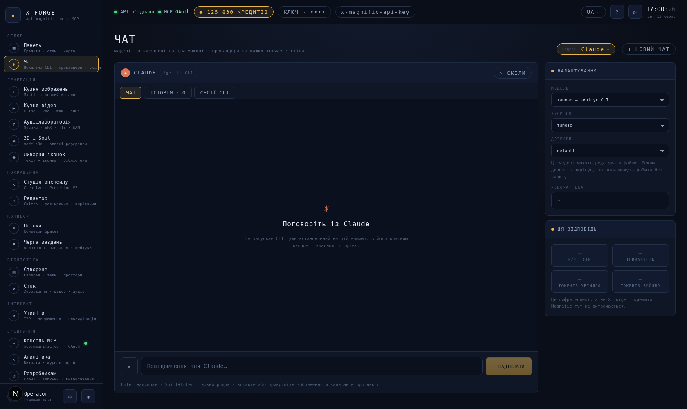

Це єдиний екран тут, який не взаємодіє з Magnific. Він взаємодіє з CLI для кодування, вже встановленими на цій машині, — Claude Code, Grok, Kimi, Qwen Code, Codex, Antigravity, — а також з будь-яким HTTP-провайдером, якому ви видали ключ. У цьому вигляді не витрачаються кредити Magnific, не створюється завдання, і нічого не з’являється в Черзі завдань: за ці ходи платить не консоль, а власний акаунт CLI.

### Вибір моделі

Одна розмова, один перемикач. Чіп угорі екрана перелічує всі моделі, якими вміє керувати X-Forge, з індикатором: зелений, коли команда є в PATH цієї машини, червоний, коли її немає. Нічого не приховується — «Grok не встановлено» корисніше за список, який мовчки його пропускає. Наведення курсора на модель показує, де знайдено її бінарний файл, — це найшвидший спосіб помітити, що консоль знайшла інший Claude, ніж той, що знаходить ваша оболонка.

Вибір зберігається на сервері, а не в браузері, бо це факт про саму інсталяцію, а не про вкладку: оберіть тут Grok, і консоль розмовлятиме з Grok, коли ви відкриєте її знову завтра.

Перемикання моделі не починає нову розмову. Кожен CLI веде власну історію, тож повернення до нього продовжує з того місця, де він зупинився; моделі, якій ставлять перше запитання в розмові, що почалася деінде, передають короткий переказ сказаного раніше, — саме це робить один чат одним чатом.

Виявлення — це пошук, а не налаштування. Встановіть CLI в іншому терміналі, і список помітить це протягом півхвилини. Зверніть увагу, що до Antigravity звертаються через команду `agy`, а не через `antigravity` у вашому PATH, — це редактор на Electron, і його запуск відкриває все IDE.

Кожен CLI говорить власним діалектом: Claude і Qwen Code використовують спільний конверт, Kimi надсилає прості повідомлення, Grok називає свої дельти `data`, Codex надсилає завершені елементи, а agy вкладає все в оновлення кроку. X-Forge читає кожен окремо і відкидає те, чого не розпізнає, бо консоль, яка вгадує незнайомий рядок, друкує те, чого модель ніколи не казала.

### Хід

Одне повідомлення один раз запускає CLI, у його власному неінтерактивному режимі, і транслює те, що він виводить. Процес не підтримується активним між ходами — безперервність забезпечує власна історія CLI, відновлена за ідентифікатором сесії, показаним поруч із назвою моделі. Це означає, що розмова переживає перезапуск цієї консолі, і що CLI володіє історією, а не X-Forge зберігає її гіршу копію.

Вихід з екрана зупиняє хід. Модель, яка продовжує працювати, коли її ніхто не читає, витрачає гроші власного акаунта на вивід, який нікуди не потрапляє.

| Елемент керування | Що це робить |
|---|---|
| Модель | Передається напряму як `--model` CLI. Порожнє значення означає власне значення CLI за замовчуванням |
| Зусилля | Бюджет міркування, там, де в CLI є такий прапорець |
| Дозволи | Що модель може робити з файлами без запиту. Це агентні CLI — вони вміють редагувати |
| Робоча тека | Де виконується CLI. За замовчуванням — ваша домашня тека |

### Історія, і власні історії моделі

Під назвою моделі розташовані три вкладки.

**CHAT** — це розмова, в якій ви перебуваєте. **HISTORY** перелічує розмови, які зберіг цей
браузер, — клацніть на одну, щоб знову її відкрити, разом з ідентифікаторами сесій CLI, що
до неї належать, тож вона продовжується, а не просто читається. **CLI SESSIONS** перелічує
те, що сама модель записала на цій машині: `~/.claude/projects`, `~/.grok/sessions`,
`~/.codex/sessions` і так далі, — історії, що існували до цієї консолі й переживуть її.
Відкриття однієї з них продовжує її — модель зберігає контекст, ця панель починається
порожньою, і про це прямо сказано.

Видалення в HISTORY забуває розмову в цьому браузері. Видалення в CLI SESSIONS видаляє
історію з диска, яка є власним записом CLI.

### Файли

Долучайте кнопкою `⊕` або вставляйте зображення прямо в поле вводу — скриншот у буфері обміну є найпоширенішим вкладенням.

Файл записується на диск, а його шлях додається в промт, бо ці CLI — агенти з доступом до файлової системи: отримавши шлях, модель сама відкриває файл, у повній роздільній здатності, тим інструментом, який їй підходить. Це також переживає відновлення пізнішого ходу, чого не витримала б вбудована копія. У провайдера немає файлової системи, тож зображення надсилається йому як дані, а все інше лише називається, а не надсилається.

Попросіть промт із картинки — і отримаєте його; наступний розділ про те, що з ним робити.

### Надсилання відповіді в генератор

Під кожною завершеною відповіддю є дві кнопки. `⧉ COPY` робить очевидне. `→ USE AS PROMPT` відкриває п’ять генераторів, які приймають промт, — Image Forge, Video Forge, Audio Lab, Icon Foundry, Upscale Studio, — і надсилає туди текст, перемикаючи на цей екран із уже заповненим полем.

Коли відповідь містить блок у лапках коду, саме він і передається, а не текст навколо нього: коли модель просять дати промт, вона вкладає промт у блок коду, а пояснення лишає поза ним, і генерувати треба не пояснення.

### Провайдери

Нижче CLI розташовані HTTP-провайдери: OpenRouter, TokenRouter, FreeInference та будь-яка кінцева точка, яку ви додасте самі в **Розробникам → Ключі моделей і провайдерів**. Працює все, що відповідає у форматі чату OpenAI за адресою `/chat/completions`. Хід провайдера оплачує цей провайдер за вашим ключем, і — на відміну від CLI — у нього немає ні файлової системи, ні інструментів, ні власної сесії, тому з кожним ходом відтворюються останні двадцять повідомлень.

### Скіли

Скіл — це тека з інструкціями, яких можна доручити дотримуватися моделі; CLI знаходить їх у власній теці скілів. Селектор поряд з назвою моделі показує список встановлених, а для тих, яких немає, шукає на [skills.sh](https://skills.sh).

Три способи потрапити всередину, і всі — крізь той самий шлюз: встановити з реєстру, завантажити власний як zip або теку, або вставити `SKILL.md` напряму. `🔍 PREVIEW` завантажує скіл із реєстру в карантин і показує його текст і вердикт, нічого не встановлюючи, — це чесний порядок дій, адже все питання в тому, чи хочете ви бачити цей текст на своїй машині.

Вибрані скіли перелічуються в промті — саме це спонукає модель звернутися до одного з них, а не просто мати його в розпорядженні. Для провайдера, який нічого не виявляє самостійно, текст скіла натомість зчитується з диска і надсилається як системне повідомлення.

**Усе, що встановлюється тут, спочатку проходить перевірку.** Завантажений файл потрапляє в теку карантину, сканер читає його там, і лише після цього він або переноситься в теку скілів, або видаляється. Є три вердикти:

| Вердикт | Значення |
|---|---|
| `INSTALL` | Нічого підозрілого не знайдено. Записується в теку скілів |
| `REVIEW` | Потрібна людина: скрипт оболонки, який сканер не може перевірити, або патерн, що пояснюється, але вартий прочитання. Встановлюється лише через перевизначення, із зазначенням причини |
| `REJECT` | Явні докази: завантаження, передане по конвеєру в оболонку, інструкція надіслати кудись облікові дані, інструкція приховати від вас свої дії. Встановити неможливо в жодному разі |

Перевірка статична — вона читає файли й зіставляє патерни, і ніколи нічого не виконує. Це ловить очевидні атаки і не ловить хитру, тому знахідки показуються вам, а не зводяться до однієї галочки. Кожне рішення, включно з перевизначенням і його причиною, дописується у `~/.x-forge/skill-audit.jsonl`.

Скіл — це чужий текст, який ось-ось буде передано моделі, здатній виконувати команди на вашій машині. Прочитайте вердикт.

---

## 6. Кузня зображень

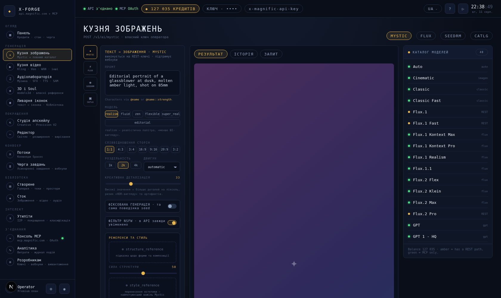

Основний генератор. Чотири інструменти вгорі визначають, яким шляхом ви працюєте.

| Інструмент | Працює через | Дає доступ до |
|---|---|---|
| `MYSTIC` | REST | Mystic з повним набором параметрів — референси, LoRA, рушії |
| `FLUX` | REST | FLUX.1 dev |
| `SEEDRM` | REST | Seedream 4.5 |
| `CATLG` | MCP | **Увесь** каталог — 48 моделей, обраних із випадного списку |

REST-інструменти дають усі елементи керування, специфічні для Magnific. Каталог дає доступ
до кожної моделі, яку пропонує Magnific, із простішим набором параметрів. Жоден із варіантів
не є кращим — це різні поверхні, і заголовок панелі завжди показує, на якій ви перебуваєте.

### Як користуватися

1. **ПРОМТ** — звичайною мовою. Якщо ви натренували персонажа в розділі
   [3D і Soul](#9-3d-і-soul), посилайтеся на нього як `@name`, або `@name::200`, щоб
   посилити його вплив.
2. **МОДЕЛЬ** — для Mystic шість стилів (`realism` виглядає найменш «згенерованим ШІ»). Для
   інструмента каталогу — випадний список усіх 48 моделей із типовим часом генерації.
3. **СПІВВІДНОШЕННЯ СТОРІН** і **РОЗДІЛЬНА ЗДАТНІСТЬ** — `2k` є розумним значенням за
   замовчуванням; `4k` коштує дорожче.
4. **ТВОРЧА ДЕТАЛІЗАЦІЯ** — скільки деталей Mystic вигадує на піксель. Високі значення
   виглядають ефектно, але спричиняють випадкові артефакти. 30–40 — гарний робочий діапазон.
5. **РЕФЕРЕНСИ ТА СТИЛЬ** — перетягніть зображення в `structure_reference`, щоб керувати
   композицією, або в `style_reference`, щоб перенести вигляд. Повзунки під кожним
   контролюють силу впливу. **Референси мовчки вимикають LoRA** — це поведінка Magnific, і
   жодної помилки не повертається, тож обирайте один підхід або інший.
6. **СТИЛІЗАЦІЯ · LORA** — персонажі та стилі, натреновані на цьому обліковому записі.
   Клацніть, щоб додати.
7. **WEBHOOK_URL** — необов'язково; консоль однаково опитує.
8. Натисніть **ГЕНЕРУВАТИ**. Кнопка завжди показує поточну оцінку.

### Робоча область

`OUTPUT` показує результат і його позначки: статус, використаний шлях, кредити, кількість
файлів. `HISTORY` — це ваші попередні успішні завдання — клацніть на одне, щоб повернути
його. `REQUEST` показує точно те, що консоль надішле, із payload'ами base64, згорнутими до
їхнього розміру. Використовуйте це, коли щось відхилено і ви хочете побачити фактичне тіло
запиту.

### Панель каталогу

Усі 48 моделей, наживо із сервера. **Бурштинова крапка** = також доступна через REST (більше
елементів керування); **зелена крапка** = лише MCP. Клацання на моделі перемикає на
інструмент каталогу з нею обраною.

---

## 7. Кузня відео

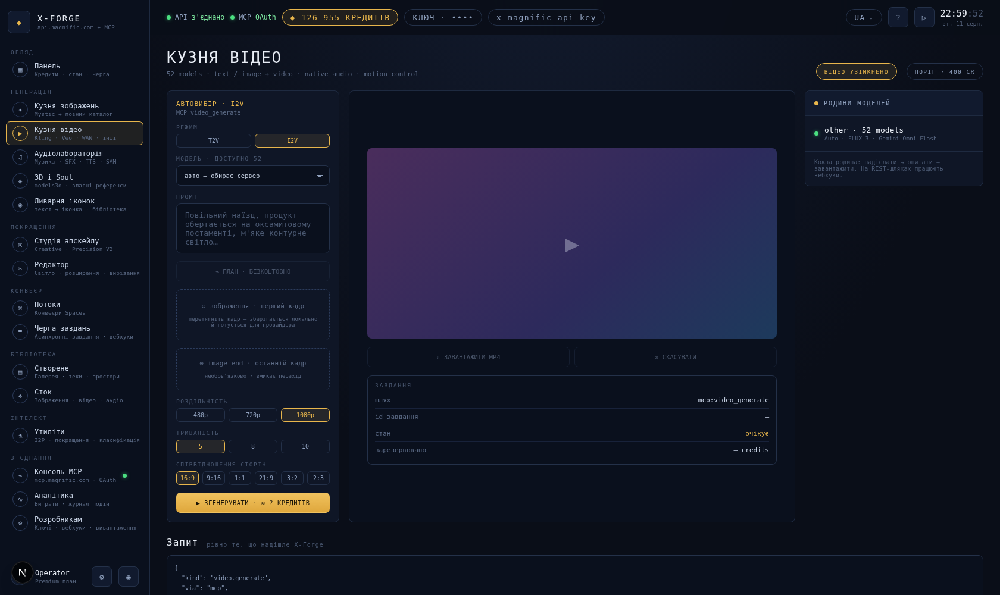

Відео — це дороге сімейство — п'ятисекундний кліп зазвичай коштує 225–1 500 кредитів — тож
цей екран побудований навколо того, щоб спершу знати ціну.

### Як користуватися

1. **РЕЖИМ** — `T2V` (лише текст) або `I2V` (зі статичного зображення).
2. **МОДЕЛЬ** — 52 моделі, або `auto`. Коли ви обираєте одну, панель показує тривалості, які
   вона приймає. Моделі з REST-шляхом працюють на вашому ключі; решта — через MCP.
3. **ПРОМТ** — опишіть рух, а не лише сцену. «Повільний дол-ін, продукт обертається на
   оксамитовому постаменті» краще за «продукт».
4. **ПЛАН · БЕЗКОШТОВНО** — запускає власний планувальник Magnific. Це нічого не коштує і
   повертає бриф, рекомендовану модель і чернетку промту. Варто зробити перед тим, як
   витратити 300 кредитів.
5. Для `I2V` перетягніть **перший кадр**. Консоль автоматично переносить його в проміжне
   сховище на URL-адресу — відеомоделі відмовляються приймати вбудовані зображення. За
   бажанням додайте **останній кадр** для переходу.
6. **РОЗДІЛЬНА ЗДАТНІСТЬ / ТРИВАЛІСТЬ / СПІВВІДНОШЕННЯ СТОРІН** — консоль перетворює їх на
   будь-який формат передавання, якого потребує ендпоінт.
7. Перемикачі: власний звук, зафіксоване кадрування, seed для відтворюваності.
8. **ГЕНЕРУВАТИ**. Усе, що перевищує ваш поріг, замість запуску створює посилання для
   підтвердження.

Моделі обираються зі списку **Model Catalog** праворуч, так само, як в Image Forge. Рядок
**Let the server pick** розташований угорі й залишає вибір на `auto`; клацання на будь-якому
іншому рядку обирає цю модель.

Панель **ЗАВДАННЯ** нижче показує ендпоінт, ідентифікатор завдання провайдера, живий статус
і те, що зарезервовано. Блок **Запит** внизу сторінки — це точний payload.

> **Якщо відео вимкнено**, кнопка відмовляється і повідомляє про це. Увімкніть його в
> **Розробникам → Ліміти рушія → VIDEO GENERATION**. Це вимкнено за замовчуванням навмисно:
> це найшвидший спосіб випадково витратити багато кредитів.

---

## 8. Аудіолабораторія

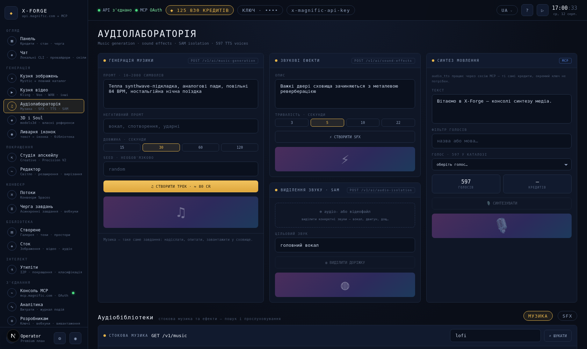

Чотири незалежні інструменти. Кожен має власний виконавець, тож ви можете одночасно мати
рендер музики і звуковий ефект у процесі, і вони не перезаписуватимуть результати одне
одного.

**Генерація музики** (REST, ~80 кредитів за 15 с) — промт, необов'язковий негативний промт,
тривалість, необов'язковий seed. Описуйте інструментовку і темп; «теплий синтвейв-підклад,
аналогові пади, 84 BPM» працює краще за «гарна музика».

**Звукові ефекти** (REST, ~20 кредитів) — один короткий опис, одна тривалість. Добре
підходить для фолі та звуків інтерфейсу.

**Виділення звуку · SAM** (REST) — перетягніть аудіо- або відеофайл, назвіть звук, який
хочете виділити («провідний вокал», «двигун», «дощ»). Керує саме опис, а не файл.

**Синтез мовлення** (MCP) — потребує сесії MCP. Випадний список голосів містить повний
каталог облікового запису (близько 600 голосів); поле фільтра шукає за назвою та мовою.
Вартість масштабується з довжиною тексту і показується до натискання кнопки.

**Бібліотеки звуку** внизу шукають у сток-каталогах музики та звукових ефектів Magnific. Це
завантаження в рахунок денної квоти вашого плану, а не покупки за кредити.

---

## 9. 3D і Soul

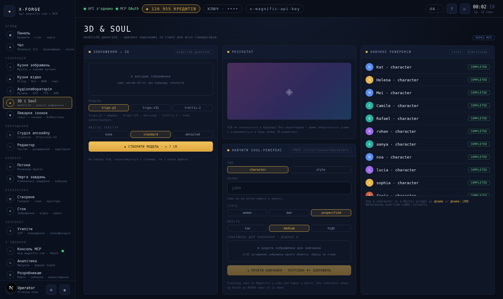

### Зображення → 3D

`models3d_generate` — це перетворення **зображення** на 3D, а не тексту на 3D. Перетягніть
зображення одного чіткого об'єкта; консоль імпортує його як створене за вас.

- `tripo-p1` — швидкий, типовий
- `tripo-v31` — вища якість
- `trellis-2` — інший підхід до реконструкції

Результат — файл GLB (~580 кредитів), який завантажується у сховище. Браузер не може
попередньо переглянути GLB без переглядача, тому файл зберігається у незмінному вигляді, щоб
ви могли відкрити його в 3D-інструменті.

### Навчання референсу Soul

Навчає Magnific персонажа або стиль, який потім можна використовувати за назвою в будь-якому
промті.

1. **TYPE** — `character` (особа) або `style` (естетика).
2. **NAME** — це буквально те, що ви потім вводитимете в промтах, у вигляді `@name`.
3. **GENDER** (лише для персонажів) і **QUALITY**.
4. **TRAINING IMAGES** — перетягніть **щонайменше чотири**, бажано 4–12, усі узгоджені: те
   саме обличчя, той самий одяг або той самий художній стиль. Кожне перетягнуте зображення
   потрапляє в проміжне сховище і додається до списку; клацніть на тег, щоб видалити його.
5. **START TRAINING**. Навчання виконується на стороні Magnific і триває певний час — референс
   з'являється у списку праворуч із позначкою `READY`, коли завершується.

### Навчені референси

Усе, що цей акаунт уже може використовувати, з обох місць, де зберігаються референси: LoRA на
REST-ключі та Library на сесії MCP. Список кешується на п'ять хвилин, оскільки endpoint
провайдера відповідає приблизно дванадцять секунд.

---

## 10. Ливарня іконок

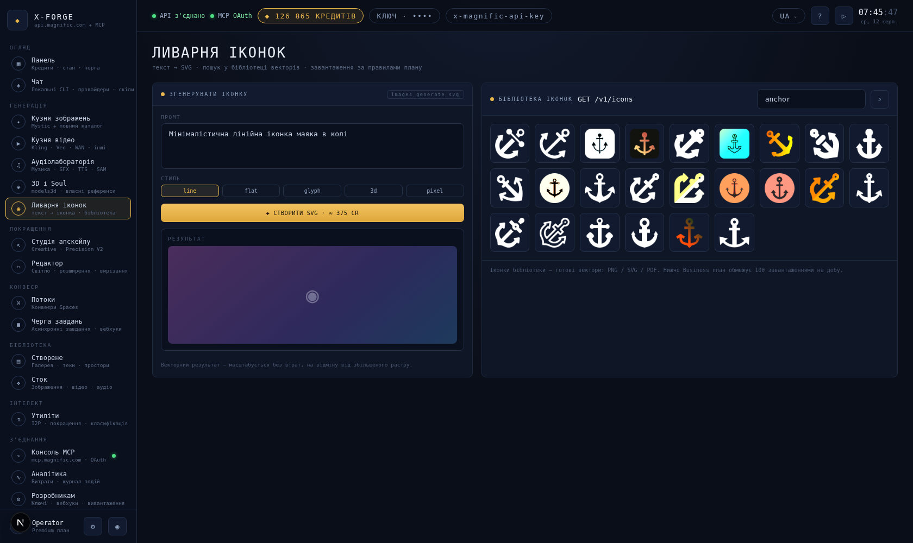

Дві половини, які відповідають на те саме запитання — «Мені потрібна іконка» — протилежними
способами.

**Generate Icon** (~375 кредитів) створює іконку, якої ще не існує, у вигляді справжнього SVG.
Опишіть її, оберіть стиль (`line`, `flat`, `glyph`, `3d`, `pixel`), згенеруйте. Векторний
результат масштабується без втрат, на відміну від апскейленої растрової іконки.

**Icon Library** шукає в каталозі готових векторів Magnific. Безкоштовно в межах ліміту
завантажень вашого плану.

**Перевірте бібліотеку, перш ніж генерувати.** Якщо іконка вже існує, повторна генерація
коштуватиме 375 кредитів без жодної користі.

---

## 11. Студія апскейлу

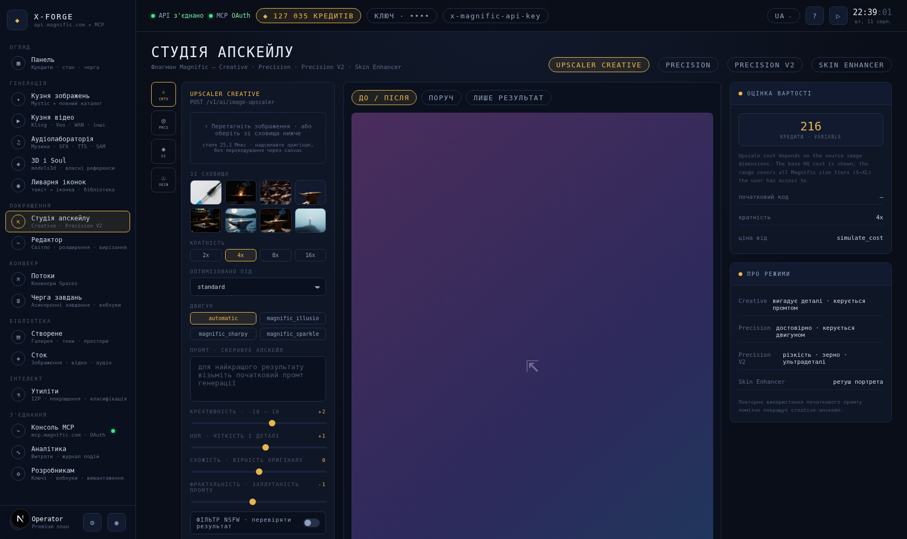

Флагманська функція Magnific, у чотирьох режимах.

| Режим | Що робить | Коли використовувати |
|---|---|---|
| **Creative** | Вигадує правдоподібні деталі, керуючись промтом | Джерело мале або розмите, і ви хочете, щоб результат виглядав ефектно |
| **Precision** | Точне збільшення на основі рушія | Вміст не повинен змінюватися |
| **Precision V2** | Точне, з керуванням різкістю / зерном / надвисокою деталізацією | Фоторобота, що потребує тонкого контролю |
| **Skin Enhancer** | Ретуш портрета | Обличчя |

### Як користуватися

1. Перетягніть зображення **або** клацніть на одне з панелі **З СХОВИЩА** — усе, що ви колись
   згенерували, за один клік.
2. **SCALE FACTOR** — від 2× до 16×. Це найбільший чинник вартості: вартість масштабується
   залежно від площі *вихідного* зображення, тож 16× для великого джерела коштує на порядок
   більше, ніж 2× для малого. Панель **Estimated Cost** праворуч показує число від самого
   провайдера та його діапазон за рівнями розміру.
3. **OPTIMIZED FOR** — вкажіть, що зображено на картинці (портрети, пейзажі, ігрові файли,
   3D-рендери…). Це має більше значення, ніж здається на перший погляд.
4. **ENGINE** — `automatic`, якщо ви свідомо не хочете `illusio`, `sharpy` або `sparkle`.
5. **ПРОМТ** — для режиму Creative. *Використайте повторно оригінальний промт генерації*,
   якщо він у вас є; це помітно покращує результат.
6. **CREATIVITY / HDR / RESEMBLANCE / FRACTALITY** — усі в діапазоні −10…+10. Починайте з 0 і
   змінюйте по одному значенню за раз. Висока creativity в поєднанні з високим HDR — це те,
   звідки береться ефект «перепрацьованого» вигляду.

Робочий простір має три режими перегляду: `BEFORE / AFTER` (пліч-о-пліч), `SIDE BY SIDE` і
`OUTPUT ONLY`.

---

## 12. Редактор

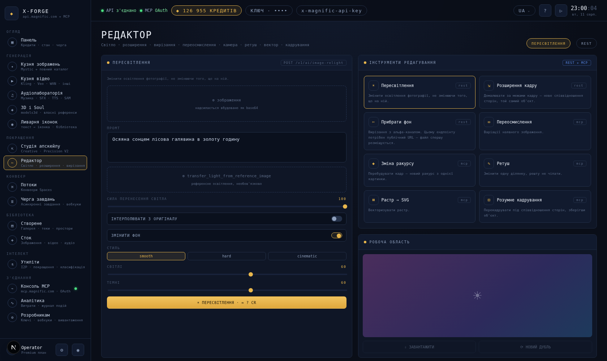

Вісім інструментів, які беруть одне зображення і повертають одне зображення. Оберіть
інструмент із сітки, перетягніть зображення, заповніть те, що потрібно цьому інструменту.
Форма змінюється залежно від інструмента.

| Інструмент | Шлях | Потребує | Примітки |
|---|---|---|---|
| **Relight** | REST | вбудоване зображення | Змінює освітлення, не змінюючи вміст. Опційно референсне зображення, з якого копіюється освітлення |
| **Image Expand** | REST | вбудоване зображення | Домальовує простір за межами кадру під нове співвідношення сторін |
| **Remove Background** | REST | **розміщений URL** | Не приймає вбудовані зображення — консоль поміщає файл у проміжне сховище за вас |
| **Reimagine** | MCP | створене | Варіації наявного зображення |
| **Change Camera** | MCP | створене | Новий ракурс тієї самої сцени |
| **Retouch** | MCP | створене | Змінити одну ділянку, залишивши решту без змін |
| **Raster → SVG** | MCP | створене | Векторизує растрове зображення |
| **Smart Crop** | MCP | створене | Перекадрування під потрібне співвідношення сторін зі збереженням об'єкта |

Вам не потрібно перейматися тим, якого формату потребують вхідні дані: одне перетягування
одразу створює всі три варіанти (локальну копію, розміщений URL і створене MCP), і кожен
інструмент бере те, що йому треба. Якщо сесія MCP недоступна, інструменти MCP повідомлять про
це прямо, а не провалюватимуться незрозуміло.

**Relight** має найглибші налаштування: силу перенесення освітлення, чи інтерполювати від
оригіналу, чи може змінюватися фон, і окремі рівні білого/чорного.

---

## 13. Потоки

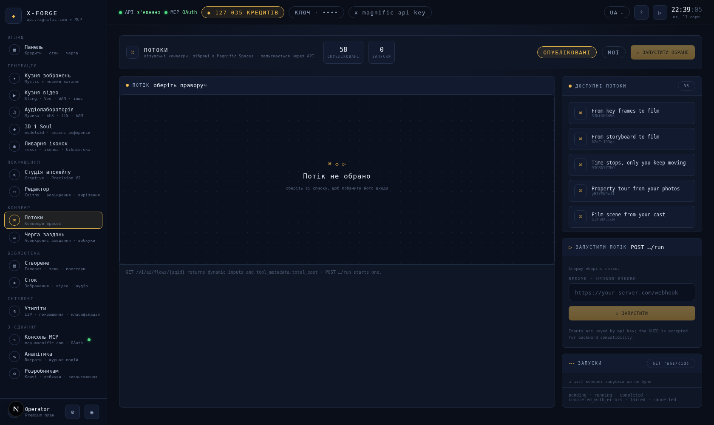

Потік — це конвеєр, який хтось побудував на полотні Spaces в Magnific і опублікував. Цей екран
запускає їх.

1. Оберіть `PUBLISHED` (увесь каталог — 57 на момент написання) або `MINE`.
2. Оберіть один. Полотно малює його форму, а заголовок показує вартість одного запуску.
3. Панель **Run Flow** будується автоматично з оголошених вхідних параметрів цього потоку — у
   кожного потоку свій набір, тож тут немає нічого жорстко закодованого. Заповніть їх.
4. За бажанням додайте вебхук.
5. **RUN**.

Запуски з'являються на панелі **Runs** із кнопкою `POLL`. Статуси належать провайдеру:
`pending`, `running`, `completed`, `completed_with_errors`, `failed`, `cancelled`.

Результати потоків дійсні протягом приблизно дванадцяти годин — коротше, ніж усе інше.

---

## 14. Черга завдань

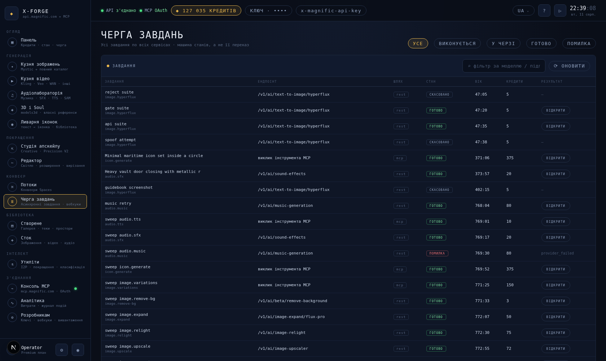

Усі завдання, які має рушій, з можливістю фільтрації за станом. Стовпці показують завдання,
точний endpoint, який воно використало, чи пройшло воно через `rest`, чи через `mcp`, його
стан, вік, кредити та що з ним можна зробити.

**Клацніть на будь-який рядок**, щоб відкрити деталі: параметри, ідентифікатор завдання у
провайдера, оцінку порівняно з фактичним результатом, а також повну історію переходів із
часовими мітками та причинами. Це найшвидший спосіб зрозуміти, що завдання насправді зробило.

### Що означають дії

| Кнопка | Коли з'являється | Що робить |
|---|---|---|
| `OPEN` | Завдання створило файли | Відкриває файл |
| `CANCEL` | До надсилання | Скасовує завдання. Нічого не витрачено |
| `RECONCILE` | Лише `needs_recon` | Запитує в Magnific, що сталося із завданням |

**`RECONCILE` — найважливіша з них.** Завдання у стані `needs_recon` означає, що консоль
втратила зв'язок після надсилання — генерація могла завершитися і списати з вас кредити.
Звірка напряму запитує провайдера: якщо результат існує, він завантажується, а запис у журнал
витрат робиться один раз; якщо завдання не вдалося, воно позначається як невдале. Консоль
ніколи мовчки не запустить його повторно, бо це означало б платити двічі за те саме зображення.

Три панелі нижче документують стратегію опитування, схему підпису вебхука та те, що консоль
робить із кожним кодом помилки провайдера.

---

## 15. Створене

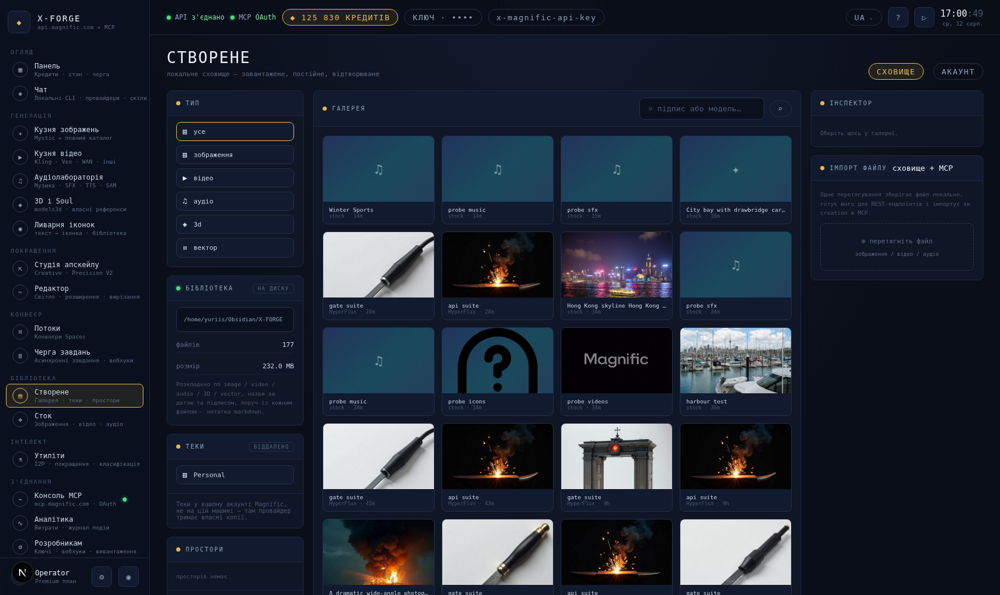

Дві бібліотеки, свідомо не об'єднані.

**СХОВИЩЕ** — усе, що ця консоль згенерувала, завантажене на ваш диск. Постійне, відтворюване,
з можливістю пошуку за міткою або моделлю.

**АКАУНТ** — власне нещодавно створене в акаунті Magnific, зроблене будь-де. URL-адреси тут
мають обмежений термін дії.

### Де насправді зберігаються файли

Панель **LIBRARY** ліворуч показує шлях, кількість файлів і розмір на диску. За замовчуванням
це `~/.x-forge/vault`; встановіть `FORGE_VAULT_DIR`, щоб розмістити його там, де ви самі
переглядаєте файли — у сховищі Obsidian, у папці проєкту — і X-Forge підтримуватиме там
порядок за вас:

```
X-FORGE/
  image/   2026-08-11_editorial-portrait_A1B2C3.jpg
           2026-08-11_editorial-portrait_A1B2C3.md
  video/   audio/   3D/   vector/
```

Кожен файл отримує поруч нотатку у форматі markdown, яка містить промт, модель, вартість,
endpoint і ідентифікатор завдання у frontmatter, а також вбудовує сам файл — тож в Obsidian
бібліотека стає доступною для перегляду, пошуку та зв'язування, а не просто папкою з
бінарними файлами.

**FOLDERS** і **SPACES** нижче позначені як `REMOTE`, бо такими і є: вони існують у вашому
акаунті Magnific, а не на цій машині.

### Відкриття файлів

Клацніть на будь-яку плитку, щоб завантажити **Inspector** і відкрити переглядач у повному
розмірі.

| | |
|---|---|
| прокручування | масштабування в напрямку курсора |
| перетягування | панорамування після наближення |
| подвійний клік | перемикання між масштабом «за розміром» і 2× |
| `+` `−` `0` | наближення, віддалення, підгонка під розмір |
| `1:1` | реальні пікселі — заголовок показує справжні розміри |
| `←` `→` | попередній і наступний файл без виходу з переглядача |
| `Esc` | закрити |

**3D-моделі відкриваються у справжньому переглядачі** — перетягування обертає модель,
прокручування наближує та віддаляє камеру. Рушій завантажується лише тоді, коли ви вперше
обираєте модель, тож галерея статичних зображень ніколи не платить за це. Файли GLB також
відображаються прямо в Inspector.

Відео та аудіо відкриваються в плеєрах повного розміру. Той самий переглядач стоїть за кожною
панеллю результатів у кузнях, тож ви можете перевірити апскейл у реальних пікселях одразу,
щойно він з'явиться.

**Імпорт файлу** — це триканальний імпортер: одне перетягування зберігає файл локально,
поміщає його в проміжне сховище для REST-endpoint'ів і імпортує його як створене MCP — те саме,
що робить кожна зона перетягування в консолі.

---

## 16. Сток

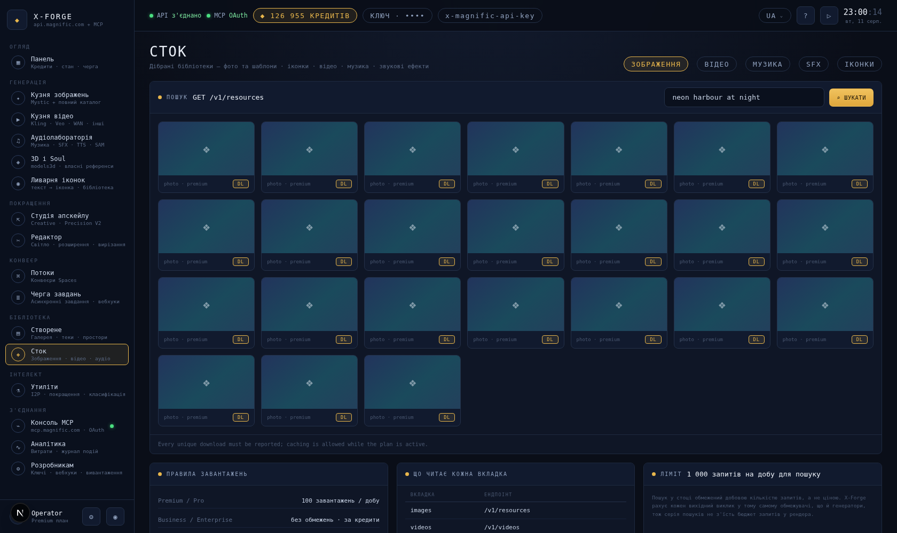

П’ять бібліотек за одним полем пошуку: зображення, відео, музика, звукові ефекти, іконки. Введіть
запит, натисніть Enter або `SEARCH`.

Сток **не** тарифікується в кредитах. На тарифі нижче Business ви отримуєте 100 завантажень на
день; на Business і вище — необмежено. Панелі внизу документують правила, який ендпойнт читає
кожна вкладка, і те, що пошук у стоку ділить той самий вихідний ліміт запитів, що й ваші рендери.

Умови використання, які варто пам’ятати: заборонено видобування даних, скрапінг, перепродаж без
модифікації.

---

## 17. Утиліти

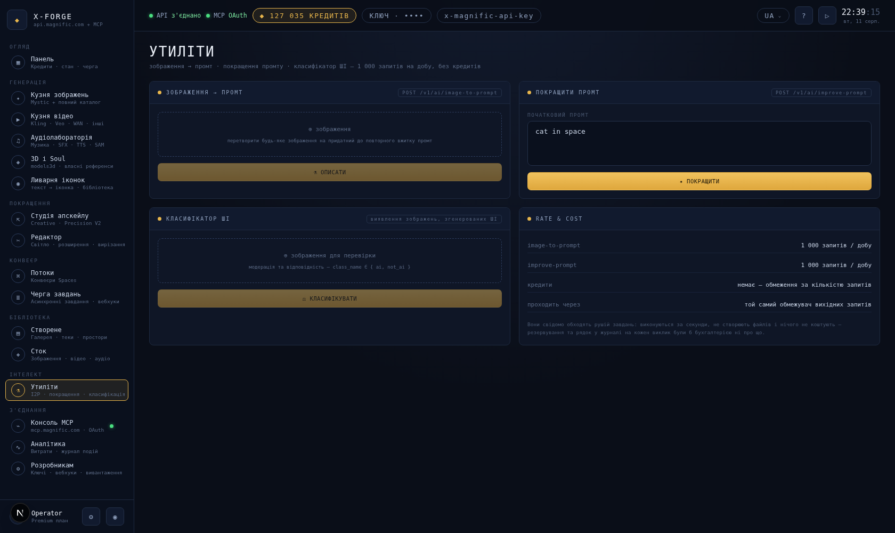

Чотири невеликі інструменти, які відповідають словами, а не файлами. Вони не витрачають кредити —
натомість обмежені 1 000 запитів на день — і виконуються негайно, оминаючи двигун завдань.

**Image → Prompt** — киньте зображення, отримайте придатний до повторного використання промт, що
його описує. `SEND TO IMPROVER` передає результат у наступний інструмент.

**Improve Prompt** — перетворює скупий промт на детальний. `IMPROVE AGAIN` повторює ітерацію.

**AI Classifier** — перевіряє, чи зображення згенероване штучним інтелектом. Ця можливість
залежить від тарифу; якщо ваш тариф її не включає, панель показує саме відповідь провайдера, а не
порожній результат.

**Video Plan** міститься у [Video Forge](#7-кузня-відео), а не тут, бо саме там він потрібен.

---

## 18. Консоль MCP

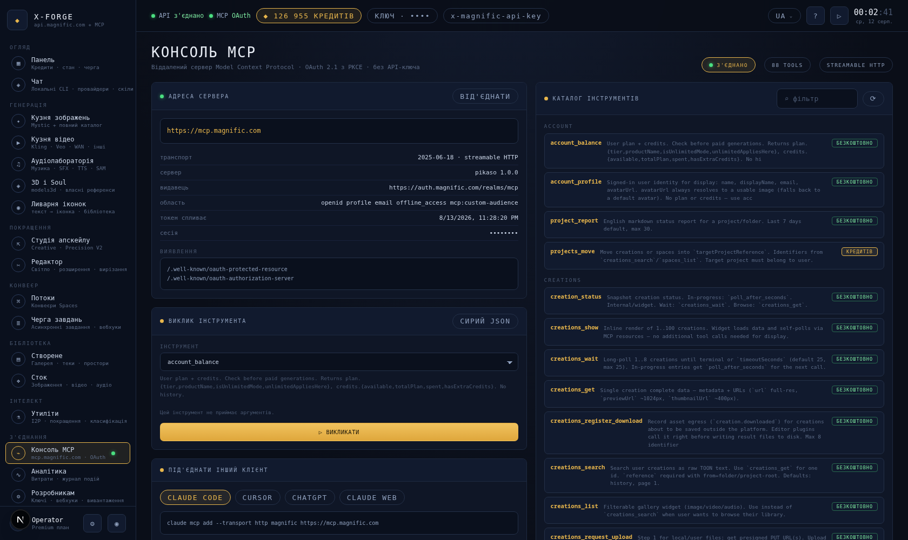

Сторона Model Context Protocol у Magnific: 88 інструментів, доступних через сесію OAuth, без
участі `api_key`.

### З’єднання

Натисніть **CONNECT**. Відкриється спливне вікно входу Magnific; підтвердьте один раз. Консоль
реєструє себе динамічно, використовує PKCE і запитує `offline_access`, щоб сесія тривала довше за
годину. Усе на сторінці оновлюється, коли ви повертаєтесь.

**DISCONNECT** забуває токени. Шляхи REST продовжують працювати.

### Панель сервера

Транспорт, ідентичність сервера, видавець (issuer), області доступу (scopes), термін дії токена та
ідентифікатор сесії. Якщо сесія порушена, ця панель повідомляє причину простими словами.

### Виклик інструмента

Це справжня консоль, а не демонстрація.

1. Оберіть інструмент зі спадного списку — усі 88, з їхніми описами.
2. Форма аргументів будується самостійно **на основі JSON-схеми цього інструмента**: enum-и стають
   спадними списками, числа надсилаються як числа, обов’язкові поля позначені. Перемкніться на
   `RAW JSON`, якщо хочете ввести об’єкт вручну.
3. **CALL TOOL**.

Інструменти, що витрачають кредити, спершу оцінюються: консоль запускає симулятор вартості,
показує вам число і чекає на **CONFIRM AND SPEND**. Безкоштовні інструменти виконуються негайно.
Результати показуються як дані, а будь-які повернені зображення відображаються прямо в тексті.

### Каталог інструментів

Усі 88 інструментів, згруповані, кожен позначений `FREE` або `CREDITS`. Фільтруйте за назвою;
клацніть на будь-який інструмент, щоб завантажити його у виклик. Цей список — це `tools/list`,
прочитаний наживо із сервера, тож інструмент, який Magnific випустить наступного тижня, з’явиться
тут без змін у коді.

### Підключення іншого клієнта

Налаштування копіюванням-вставленням для Claude Code, Cursor, ChatGPT та Claude web. Працює
будь-який streamable-HTTP MCP клієнт.

---

## 19. Аналітика

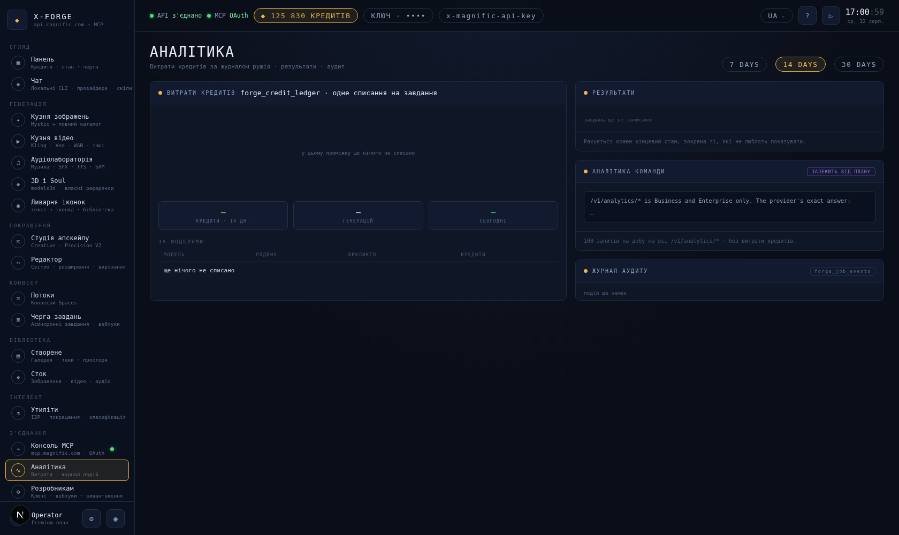

**Credit Usage** — це власний журнал витрат консолі: один рядок на завдання, записаний один раз, у
тій самій транзакції, що закрила його резервування. Оберіть 7, 14 або 30 днів. Стовпчики — це
щоденні витрати; наведіть курсор для точних цифр.

**By Model** розбиває ті самі витрати за моделлю та можливістю, і саме так ви дізнаєтесь, що
апскейли непомітно є вашою найбільшою статтею витрат.

**Outcomes** враховує кожен кінцевий стан, включно з неприємними — показуються збої, відхилення
через бюджет і скасування.

**Team analytics** — це власний ендпойнт Magnific `/v1/analytics/*`, доступний на тарифах Business
та Enterprise. На інших тарифах панель повідомляє саме це, повідомленням самого провайдера, а не
показує порожній графік.

**Audit trail** — це журнал подій завдання: кожен перехід стану з його причиною.

---

## 20. Розробникам

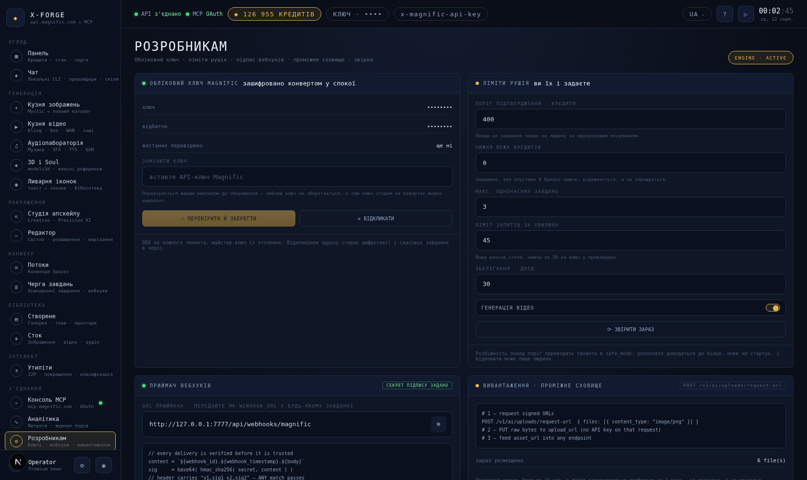

Панель керування самим двигуном.

### Облікові дані Magnific

Показує останні чотири символи, скорочений відбиток (fingerprint) і час останньої перевірки ключа.
Сам ключ ніколи не відображається, не повертається і не логується.

- **VERIFY & SAVE** — вставте новий ключ. Він перевіряється живим запитом *перед* збереженням;
  недійсний ключ ніколи не зберігається, і відновлюється попередній.
- **REVOKE** — негайно стирає збережений ключ і скасовує все, що в черзі.

### Ліміти двигуна

Ви встановлюєте їх самі. Змініть значення і натисніть `SAVE`.

| Ліміт | Що він робить | Розумне значення за замовчуванням |
|---|---|---|
| **APPROVAL THRESHOLD** | Будь-яке завдання з оцінкою вище цього значення чекає на людину | 400 кредитів |
| **CREDIT FLOOR** | Завдання, які опустили б баланс нижче цього значення, відхиляються | 0, або резерв, якого ви не хочете торкатись |
| **MAX CONCURRENT JOBS** | Скільки завдань може виконуватись одночасно | 3 |
| **RPM LIMIT** | Ваша власна стеля, нижче за ліміт Magnific у 50/хв на ключ | 45 |
| **RETENTION · DAYS** | Скільки днів зберігаються файли сховища | 30 |
| **VIDEO GENERATION** | Головний перемикач для всієї родини відео | Вимкнено, доки не знадобиться |

Якщо звірювач (reconciler) коли-небудь переведе двигун у `safe_mode` — це відбувається, коли
баланс відхиляється від того, що очікує журнал витрат, — саме на цій панелі ви прочитаєте причину
і натиснете `RESUME`. **RECONCILE NOW** запускає цю перевірку на вимогу.

### Приймач вебхуків

URL-адреса, яку слід передавати як `webhook_url` для будь-якого завдання, схема перевірки та
журнал останніх доставок наживо, позначених `VERIFIED` або `REJECTED`. На неперевірену доставку
відповідають `401`, і вона ніколи не обробляється; повторно відтворену поза межами вікна свіжості
відхиляють навіть за дійсного підпису.

### Uploads · Проміжне сховище

Скільки файлів наразі перебуває в проміжному сховищі на боці провайдера, і трикроковий протокол,
що лежить в основі кожної зони перетягування в консолі. Файли в проміжному сховищі спливають
приблизно за тиждень — довготривале зберігання забезпечує сховище (vault).

---

## 21. Сторінка підтвердження


Коли оцінка завдання перевищує ваш поріг — або провайдер взагалі не може назвати ціну — консоль
його не запускає. Натомість вона дає посилання на кшталт:

```
http://127.0.0.1:7777/a/job_0MSOQ53FKBC0DEZI0LW/6fa58580e9476168d43a9458a315c43e
```

Сторінка відкривається без сесії, тож ви можете надіслати її будь-кому, хто розпоряджається
бюджетом. Вона показує модель, параметри, оцінку, ваш доступний до витрат баланс і час, що
залишився.

- **APPROVE & RUN** ставить завдання в чергу.
- **CANCEL JOB** завершує його, не витративши нічого.

Посилання **одноразове** й спливає через п’ятнадцять хвилин. Навмисно немає ні ендпойнта API, ні
інструмента MCP, який підтверджував би завдання — агент не повинен мати змоги імітувати людину, що
каже «так».

---

## 22. Вартість коротко

Виміряно на акаунті Premium. Сприймайте як порядок величини, а не як прайс-лист — консоль завжди
показує власну оцінку провайдера перед тим, як ви підтверджуєте.

| Операція | Типово | Примітки |
|---|---|---|
| Видалення фону | 3 | Найдешевше тут |
| Зображення · HyperFlux | 5 | Найдешевший генератор; ідеальний для тестів |
| Текст у мовлення | 2–10 | Масштабується за довжиною тексту |
| Звуковий ефект | 20 | |
| Зображення · Mystic / FLUX.2 / Seedream | 50 | |
| Розширення зображення | 50 | |
| Апскейл 2× | 72 | Масштабується за площею **результату** |
| Релайт | 75 | |
| Музика, 15 с | 80 | |
| Варіації | 150 | |
| Апскейл 4× на джерелі 1k | ~216 | |
| Відео, 5 с | 225–1 500 | Сильно різниться залежно від моделі |
| Іконка → SVG | 375 | Спершу пошукайте в бібліотеці |
| Зображення → 3D GLB | 580 | |
| Завантаження зі стоку | 0 | Денна квота, не кредити |
| Утиліти | 0 | 1 000 запитів/день |

Повний прогін кожної можливості консолі, по одному разу, на найдешевших налаштуваннях, коштує
близько 2 300 кредитів.

---

## 23. Коли щось іде не так

### "rejected_budget · rpm_exceeded"

Ви досягли своєї стелі запитів на хвилину. Обмежувач (shaper) захищає ключ. Зачекайте хвилину або
підвищте `RPM LIMIT` у Розробникам — але не вище 50, що є власним лімітом Magnific.

### "rejected_budget · insufficient_credits"

Оцінка опустила б баланс нижче вашого `CREDIT FLOOR`. Знизьте цей поріг, поповніть акаунт або
оберіть дешевшу модель. Консоль не буде мовчки знижувати якість, аби вкластися в бюджет.

### "rejected_budget · video_disabled"

Увімкніть відео в Розробникам → Ліміти двигуна.

### "rejected_budget · max_concurrent"

Забагато завдань виконується одночасно. Зачекайте або підвищте ліміт.

### Завдання застрягло в `needs_recon`

Консоль втратила зв’язок після надсилання. Відкрийте Чергу завдань, натисніть `RECONCILE`. Якщо
робота завершилась, вона завантажується і списується один раз; якщо не вдалась, завдання
закривається. Ніколи не надсилайте повторно — це призведе до подвійного списання.

### "Validation error" з назвою поля

Провайдер відхилив конкретний параметр, і консоль передає його точну скаргу без змін —
`duration: Input should be '5' or '10'` означає буквально це. Вкладка `REQUEST` в Image Forge та
блок запиту у Video Forge показують, що було надіслано.

### Інструмент MCP повідомляє "not connected"

Сесія OAuth завершилась або була розірвана. **Консоль MCP → CONNECT**. Шляхи REST тим часом
продовжують працювати; це впливає на TTS, 3D, оцінки вартості, повний каталог і більшість Edit
Suite.

### "image → video needs a hosted image"

Статичне зображення не потрапило у проміжне сховище. Перекиньте його ще раз і надішліть повторно —
консоль автоматично розміщує завантажені файли в проміжному сховищі, але файл, доданий до того, як
з’явилась сесія MCP, може не мати розміщеної копії.

### Одна генерація просто не вдалась

У провайдерів бувають невдалі хвилини. Консоль один раз повторює операцію, що піддається повтору,
після невдачі, потім зупиняється і повідомляє вам. Найшвидший спосіб перевірити — надіслати ще раз
із трохи іншим промтом: ідентичний промт за задумом повертає те саме невдале завдання.

### Баланс виглядає неправильним

Натисніть **RECONCILE NOW** у Розробникам. Це порівнює акаунт із журналом витрат; відхилення понад
поріг переводить двигун у `safe_mode`, тож нічого нового не витрачається, доки ви не розберетесь.
